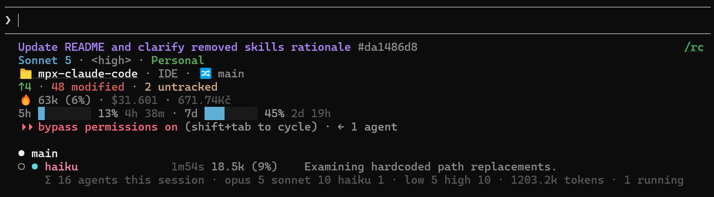

# mpx — Claude Code Customization Toolkit

A collection of skills, agents, hooks, scripts, and instructions that extend [Claude Code](https://docs.anthropic.com/en/docs/claude-code) with GitHub-driven project workflows, TDD execution, and general-purpose dev tools.

**Two ways to use it:**

- **Full workflow** — requirements → PRD → GitHub issues → TDD execution → PR
- **Individual skills** — cherry-pick general-purpose tools (commits, PRs, reviews, design, etc.)

## Terms

| Term    | Meaning                                                                      |
| ------- | ---------------------------------------------------------------------------- |
| **PRD** | Product Requirements Document — structured spec created from requirements    |
| **TDD** | Test-Driven Development — write a failing test first, then implement to pass |
| **ADR** | Architecture Decision Record — documents _why_ a technical choice was made   |

### Issue Labels

| Label    | Meaning                                                                                  |
| -------- | ---------------------------------------------------------------------------------------- |
| **HITL** | Human In The Loop — issue requires human decisions (architecture, design, API contracts) |
| **AFK**  | Away From Keyboard — issue can be implemented and merged autonomously                    |

## Installation

### Prerequisites

- [Claude Code CLI](https://docs.anthropic.com/en/docs/claude-code) installed and working

## Workflow

```
/mp-grill                  ◄── Grill user on plan/design/requirements → update .mpx/ docs
        │
        ▼
/mp-to-prd                 ◄── CONTEXT.md → PRD as GitHub issue (with module design)
        │
        ▼
/mp-to-issues              ◄── PRD → vertical-slice sub-issues (HITL/AFK classified)
        │
        ▼
/mp-execute                ◄── Orchestrate TDD, checks, review, unresolved triage,
                            commit, push, PR, and CI-green auto-merge for issue-driven work
```

`/mp-commit-push-pr` and `/mp-pr` remain available as standalone Git workflows when implementation is already done and you only want to prepare or update a PR.

**For bugs:** `/mp-bug-report` investigates root cause, designs TDD fix plan, creates labeled issue.

**Cross-cutting:** `/mp-vocabulary` maintains canonical domain terms in `.mpx/CONTEXT.md` § Domain Language.

Between sessions, use `/mp-handoff` to save context to `HANDOFF.md` for continuity.

### Execution Pipeline (`/mp-execute`)

`/mp-execute` is the core execution orchestrator — it executes one GitHub issue per run (or one inline task/checklist), while still accepting milestone input to select a single issue.

```
┌──────────────────────────────────────────────────────────────────────────┐
│                           /mp-execute #42                                │
└─────────────────────────────────┬────────────────────────────────────────┘
                                      │
                        ┌────────────▼────────────┐
                        │ 1) Resolve Input        │  #issue, milestone, inline
                        └────────────┬────────────┘
                                      │
                        ┌────────────▼────────────┐
                        │ 2) Analyze (issues)     │  mp-issue-analyzer
                        └────────────┬────────────┘
                                      │
                      open questions? yes -> ask user
                      library gaps?  yes -> mp-context7-docs-fetcher
                                      │
                        ┌────────────▼────────────┐
                        │ 3) Detect Checks        │  detect-check-scripts.sh
                        │                         │  (CHECK_ALL-aware)
                        └────────────┬────────────┘
                                      │
                        ┌────────────▼────────────┐
                        │ 4) TDD Execution        │  mp-tdd-executor handles
                        │                         │  red-green-refactor loop
                        └────────────┬────────────┘
                                      │
                              --no-tdd? yes -> skip to 5
                                      │
         ┌─────────────────────────▼──────────────────────────────────────┐
         │ 5) Verify-Fix Loop (one nested orchestrator sub-agent)         │
         │   shared/VERIFY_FIX_ORCHESTRATOR.md: static checks + tests +   │
         │   4 reviewers (--full-review: 7) + optional browser verify;    │
         │   fixes dispatched inside; returns bounded JSON only           │
         └─────────────────────────┬──────────────────────────────────────┘
                                      │
                        ┌────────────▼────────────┐
                        │ 6) Unresolved Triage    │  issues only,
                        │    (conditional)        │  mp-unresolved-issue-tracker
                        └────────────┬────────────┘
                                      │
                        ┌────────────▼────────────┐
                        │ 7) Commit + Push        │  mp-git-committer,
                        │                         │  refs/fixes #N
                        └────────────┬────────────┘
                                      │
                        ┌────────────▼────────────┐
                        │ 8) PR + Mergeable       │  issues only, mp-pr-manager;
                        │                         │  conflict resolution delegated
                        └────────────┬────────────┘
                                      │
                        ┌────────────▼────────────┐
                        │ 9) CI Green Gate        │  fix loop delegated per
                        │                         │  shared/CI_FIX_AGENT.md
                        └────────────┬────────────┘
                                      │
                        ┌────────────▼────────────┐
                        │ 10) Finalize            │  report as PR comment,
                        │                         │  auto-merge (default)
                        └─────────────────────────┘
```

Pipeline summary:

1. Resolve input (`#issue`, milestone, or inline task/checklist)
2. Analyze issue context via `mp-issue-analyzer` (issues only)
3. Detect checks via `detect-check-scripts.sh` (supports `CHECK_ALL` fallback logic)
4. Execute TDD via `mp-tdd-executor` (unless `--no-tdd`)
5. Verify-fix loop in one nested orchestrator sub-agent (`skills/shared/VERIFY_FIX_ORCHESTRATOR.md`): static checks, tests, reviewers, optional browser verify — fixes applied inside
6. Triage unresolved items with `mp-unresolved-issue-tracker` (issues only)
7. Commit and push via `mp-git-committer`
8. Create/update PR via `mp-pr-manager`, then ensure mergeable (conflict resolution delegated)
9. CI green gate — failures fixed by a sub-agent per `skills/shared/CI_FIX_AGENT.md`
10. Finalize: post the report as a PR comment, then auto-merge (default)

Since 2.0, the main agent is a pure orchestrator: the review-fix, test-fix, and CI-fix loops run inside nested sub-agents that return bounded JSON — main never reads raw findings, test failures, or CI logs.

**Flags:** `--no-tdd` skips TDD for trivial work, `--full-review` adds security/performance/error-handling reviewers (7 total), `--no-review` skips reviewer sub-agents, `--no-auto-merge` leaves the PR open instead of auto-merging after CI is green.

**TDD principles:** tests are still mandatory by default. `mp-execute` now delegates TDD execution to `mp-tdd-executor`, which enforces red-before-green and minimal implementation. See `skills/mp-execute/` for [test quality](skills/mp-execute/tests.md) and [mocking strategy](skills/mp-execute/mocking.md), and `skills/shared/` for [deep modules](skills/shared/deep-modules.md) and [interface design](skills/shared/interface-design.md).

## Planning System (Hybrid)

Planning uses GitHub Issues for tracking and local files for persistence:

**GitHub (tracking + execution):**

- **Milestones** = Epics
- **Issues** = Tasks (PRDs, sub-issues with blocking relationships)
- **Project Board** = Visual tracking

**Local `.mpx/` (persistent knowledge):**

```
.mpx/
├── CONTEXT.md           # Domain language, feature index, constraints (read-heavy)
└── DECISIONS.md         # Settled architectural decisions with rationale (write-heavy)
```

See `skills/shared/DOCUMENTATION_STRATEGY.md` for format details and skill responsibilities.

## Skills Reference

### Shared References (`skills/shared/`)

Cross-skill reference library — plain reference files, no SKILL.md, not runnable. Skills load them at run time via `${CLAUDE_SKILL_DIR}/../shared/<FILE>.md`:

| File                       | Purpose                                                                        |
| -------------------------- | ------------------------------------------------------------------------------ |
| `BOARD_CONVENTION.md`      | Obsidian board format, content→type map, four-lane pipeline                    |
| `CI_FIX_AGENT.md`          | CI-fix sub-agent contract with bounded JSON return (mp-execute, mp-ship)       |
| `deep-modules.md`          | Deep vs shallow module design (Ousterhout)                                     |
| `DOCUMENTATION_STRATEGY.md`| `.mpx/` CONTEXT.md + DECISIONS.md formats and skill responsibilities           |
| `GIT_COMMIT_WORKFLOW.md`   | Phased commit/push/PR delegation shared by the git skills                      |
| `GITHUB_ISSUE_TEMPLATE.md` | Canonical issue body format, labels, HITL/AFK classification                   |
| `interface-design.md`      | Interface design rules for testability                                         |
| `PLAYWRIGHT_TESTING.md`    | Raw-Playwright reliability contract (sanity-gate, assert-don't-eyeball, auth)  |
| `REVIEWER_PROTOCOL.md`     | Verification discipline + report format for the 7 `mp-reviewer-*` agents       |
| `VERIFY_FIX_ORCHESTRATOR.md`| Nested verify-fix orchestrator contract (checks/reviewers/tests, bounded JSON)|

### Planning Skills

| Skill              | Description                                                                                        |
| ------------------ | -------------------------------------------------------------------------------------------------- |
| `/mp-grill`        | Stress-test plan/design/requirements via relentless Q&A (auto-updates CONTEXT.md + DECISIONS.md)   |
| `/mp-to-prd`       | CONTEXT.md → PRD as GitHub issue (module design, implementation & testing decisions)               |
| `/mp-to-issues`    | Break PRD into vertical-slice sub-issues with HITL/AFK classification and blocking                 |
| `/mp-hitl`         | Resolve HITL issues into AFK-ready by grilling decisions (`lowest` or `most-blocking` order)       |
| `/mp-vocabulary`   | Create/update `.mpx/CONTEXT.md` § Domain Language — canonical domain terms, aliases, relationships |
| `/mp-issue-create` | Create well-structured GitHub issues (feature, chore, docs) with optional PRD linking              |
| `/mp-bug-report`   | Investigate root cause → TDD fix plan → GitHub issue (labeled bug). Accepts multiple bugs          |
| `/mp-prd-review`   | Comprehensive PRD-end review: code quality, architecture, cleanup, docs, unresolved items           |

### Execution Skills

| Skill         | Description                                                                                                                                          |
| ------------- | ---------------------------------------------------------------------------------------------------------------------------------------------------- |
| `/mp-execute` | Orchestrate issue execution: TDD via `mp-tdd-executor`, verify-fix loop, unresolved triage, commit, push, PR, CI green gate, auto-merge. `--no-tdd` to skip tests |

### Board Workflow (Obsidian)

Turn an Obsidian board (bug/task/feature notes with pasted screenshots) into GitHub issues and autonomous batch fixes. All three follow `skills/shared/BOARD_CONVENTION.md` (board format, content→type map, four-lane pipeline). The lane (`# To Process` → `# Ready to implement` → `# Manual testing` → `# Archive`) is the state machine; skills move items between lanes but never touch the checkbox, which is the user's own manual-verification flag.

| Skill                 | Description                                                                                                                                                |
| --------------------- | --------------------------------------------------------------------------------------------------------------------------------------------------------- |
| `/mp-board-setup`     | One-time: create the vault board (four-lane skeleton) + `.mpx/BOARD.md` symlink and `.mpx/board-files` junction (both gitignored)                           |
| `/mp-board-to-issues` | Convert `# To Process` notes → labelled GitHub issues (merge, dedup, size, AFK/HITL), moving each item to `# Ready to implement` with `→ #N` appended       |
| `/mp-batch-execute`   | Autonomously implement a batch of AFK issues / the board's To Process items: sequential fix sub-agents on one branch, verify (checks + tests + code review via `/mp-review` + visual Playwright), one PR, then move items to `# Manual testing`. `--full-review` / `--no-review` |

### Testing Skills

| Skill                 | Description                                                                                                                        |
| --------------------- | --------------------------------------------------------------------------------------------------------------------------------- |
| `/mp-playwright-test` | Reliable raw-Playwright visual verification over a scope (uncommitted / current PR / verbal area) — per-surface PASS/FAIL with measured values + screenshots |

`/mp-playwright-test` and `/mp-batch-execute`'s verify gate both follow `skills/shared/PLAYWRIGHT_TESTING.md` — the raw-Playwright reliability contract (stale-worktree sanity-gate, assert-don't-eyeball, programmatic auth, never `networkidle`). The MCP-based `mp-playwright-tester` agent is for exploratory testing only.

### Code Quality Skills

| Skill           | Description                                                                                              |
| --------------- | -------------------------------------------------------------------------------------------------------- |
| `/mp-check-fix` | Deterministically detect and run check scripts, then fix failures — `CHECK_ALL` first, else typecheck/lint/format/build ("check fix", "run checks and fix") |
| `/mp-review`    | Unified code review (scope: PR, branch, changes)                                                         |

### Periodic Maintenance Skills

Run after larger chunks of work (milestone end, PRD completion, or on a regular cadence). Sorted by human attention required — lowest first.

| Skill                     | Scope             | Attention | Notes                                                                  |
| ------------------------- | ----------------- | --------- | ---------------------------------------------------------------------- |
| `/mp-fallow-fix`          | Whole repo        | Low       | Auto-fixes dead code. Creates PR with findings.                        |
| `/mp-suppression-audit`   | Whole repo        | Low       | Audits eslint-disable, @ts-ignore, etc. Auto-fixes + creates PR.       |
| `/mp-consolidate-context` | `.mpx/CONTEXT.md` | Low       | Removes duplicates, tightens language. Fully automatic.                |
| `/mp-skill-audit`         | All skills        | Low       | Checks 12 consistency rules, auto-fixes drift. Creates report.         |
| `/mp-harvest-decisions`   | Last 30d sessions | Low       | Scans transcripts for decisions → CONTEXT.md + DECISIONS.md.           |
| `/mp-components-audit`    | Whole repo (UI)   | Medium    | Finds native elements / detached styles that should use design-system components, wrong variants, color-token bypass. Reports by default; `autofix` applies mechanical fixes. |
| `/mp-update-docs`         | Whole repo        | Medium    | Reviews README, CLAUDE.md, AGENTS.md for staleness. Confirms updates.  |
| `/mp-code-clean`          | Whole repo        | Medium    | Dead code removal, deduplication. Pass folder for focused scope.       |
| `/mp-decompose`           | Whole repo        | Medium    | Splits oversized files into modules. Pass file for focused scope.      |
| `/mp-architecture-review` | Whole repo        | High      | Interactive — grills about pain points, proposes deepening candidates. |

All maintenance skills (except architecture-review and components-audit) auto-fix findings and present a PR for review. `components-audit` reports by default and auto-fixes only when passed `autofix`.

### Design Skills

| Skill             | Description                                                                        |
| ----------------- | ---------------------------------------------------------------------------------- |
| `/mp-design-ui-3` | Generate multiple UI variants in different visual styles using parallel sub-agents |

### Git Skills

| Skill                | Description                                                           |
| -------------------- | --------------------------------------------------------------------- |
| `/mp-commit`         | Stage and commit with conventional format                             |
| `/mp-commit-push`    | Commit and push (no PR)                                               |
| `/mp-pr`             | Create or update PR from existing commits (`draft` arg optional)      |
| `/mp-commit-push-pr` | Full workflow — commit, push, create/update PR (`draft` arg optional) |
| `/mp-sync-base`      | Merge target branch into current branch                               |
| `/mp-ship`           | Ship finished work: sync base, commit, push, PR, wait for CI green, merge |

`/mp-ship` delegates base sync to the `/mp-sync-base` skill and runs its CI-fix loop in a delegated sub-agent per `skills/shared/CI_FIX_AGENT.md` — it watches CI green explicitly before merging (never `gh pr merge --auto` as the gate).

### Deprecated Skills

Retired skills and agents are archived (not deleted) under [`deprecated/`](deprecated/) — `deprecated/skills/` and `deprecated/agents/` — for history/reference. They are not installed and not runnable as-is. Highlights:

| Skill                          | Description                             |
| ------------------------------ | --------------------------------------- |
| `/mp-release`                  | Bump version, push tag, verify CI       |
| `/mp-grill-me`                 | Superseded by `/mp-grill`               |
| `/mp-grill-requirements`       | Superseded by `/mp-grill`               |
| `/mp-consolidate-requirements` | Superseded by `/mp-consolidate-context` |

See `deprecated/skills/` for the full list of retired skills and `deprecated/agents/` for retired agents.

### Setup Skills

| Skill                    | Description                                                  |
| ------------------------ | ------------------------------------------------------------ |
| `/mp-setup-sveltekit`    | Create SvelteKit project from template with GitHub setup     |
| `/mp-setup-react-native` | Create React Native monorepo from template with GitHub setup |
| `/mp-init-repo`          | Initialize git repo with .gitignore and .claude/ structure   |

### Utility Skills

| Skill                         | Description                                                                                 |
| ----------------------------- | ------------------------------------------------------------------------------------------- |
| `/mp-handoff`                 | Create or update HANDOFF.md with session progress summary for continuity between sessions   |
| `/mp-tutorial-create`         | Generate interactive self-contained HTML tutorials (topic or code-showcase) from compact markdown source — quizzes, walkthroughs, theme-aware Mermaid diagrams, and an interactive CSS playground with Froggy-style challenges — compiled to `OneDrive/tutorials/<category>/` with dashboard index |
| `/mp-continue`                | Recover interrupted sub-agent / background work after a session-limit hit or crash, then continue |
| `/mp-skill-create`            | Create new skills with structured conventions (SKILL.md <200 lines, runs `/mp-skill-audit`) |
| `/mp-agent-create`            | Create new custom agents with structured conventions and review checklist                   |
| `/mp-script-discovery`        | Discover runnable scripts and dev servers (wraps `scripts/detect-project-scripts.sh`, single-sourced there) |
| `/mp-symlink`                 | Create & verify Windows symlinks/junctions the way that works in Claude Code (PowerShell `New-Item`, not `ln -s`/`mklink`) |
| `/mp-gemini-fetch`            | Fetch blocked sites via Gemini CLI                                                          |
| `/mp-publish-obsidian-plugin` | Publish Obsidian plugin to community directory                                              |
| `/mp-yoursafe-overview`       | (Personal) Regenerate the Yoursafe/Verotel onboarding HTML reference from live sources      |

## Agents

| Agent                       | Model  | Description                                                                 |
| --------------------------- | ------ | --------------------------------------------------------------------------- |
| mp-executor                 | Sonnet | Executes grouped task chunks                                                |
| mp-issue-analyzer           | Opus   | Analyzes issues and codebase, creates execution plans                       |
| mp-issue-finder             | Haiku  | Finds issue matching a PR branch                                            |
| mp-tdd-executor             | Opus   | Executes strict TDD red-green-refactor loops for behaviors                  |
| mp-ui-variant-generator     | Opus   | Generates a single UI variant in a specific design style                    |
| mp-playwright-tester        | Sonnet | Browser test automation via Playwright MCP (headless, works remotely)       |
| mp-checker                  | Haiku  | Runs check commands and reports failures                                    |
| mp-context7-docs-fetcher    | Haiku  | Fetches library docs via Context7 MCP                                       |
| mp-git-committer            | Haiku  | Stages, commits, and optionally pushes with conventional commit format      |
| mp-pr-manager               | Haiku  | Creates or updates GitHub PRs with conventional title/body format           |
| mp-unresolved-issue-tracker | Sonnet | Routes unresolved implementation items to sibling issues or tracking issue  |
| mp-reviewer-best-practices  | Sonnet | Best practices and conventions reviewer (with language-specific references) |
| mp-reviewer-code-quality    | Sonnet | DRY, naming, maintainability reviewer                                       |
| mp-reviewer-error-handling  | Sonnet | Error handling and resilience reviewer                                      |
| mp-reviewer-performance     | Sonnet | Performance reviewer                                                        |
| mp-reviewer-security        | Sonnet | Security reviewer (OWASP-focused)                                          |
| mp-reviewer-spec-alignment  | Sonnet | Spec compliance and scope reviewer                                          |
| mp-reviewer-test-quality    | Sonnet | Test correctness, anti-patterns, redundancy, and mocking discipline reviewer|
| mp-scanner-architecture     | Sonnet | Lightweight architecture scanner for PRD-end review                         |

Agents are spawned automatically by Claude Code when task context matches their description.

All 7 `mp-reviewer-*` agents read the shared `skills/shared/REVIEWER_PROTOCOL.md` (verification discipline + report format); role-specific judgment criteria stay in each agent file.

### Language-Specific Review References

Reviewers load framework-specific guides from `agents/references/` when relevant code is detected:

| Reference              | Scope                                                        |
| ---------------------- | ------------------------------------------------------------ |
| `typescript-review.md` | Type narrowing, generics, utility types, async patterns      |
| `react-review.md`      | Hooks discipline, RSC, React 19 Actions, TanStack Query v5   |
| `svelte-review.md`     | Svelte 5 runes, $state/$derived/$effect, component structure |
| `python-review.md`     | Type hints, async patterns, packaging                        |
| `rust-review.md`       | Ownership, lifetimes, error handling, async                  |

## Hooks

Hook scripts in `hooks/` run automatically during Claude Code lifecycle events. Configured via `settings.json`.

| Hook                         | Event                    | Description                                                                |
| ---------------------------- | ------------------------ | -------------------------------------------------------------------------- |
| `enforce-pkg-mgr.js`         | PreToolUse (Bash)        | Blocks wrong package manager commands (detects from lockfile)              |
| `pre-commit-gate.js`         | PreToolUse (Bash)        | Runs `check:all` (Vite Plus) or typecheck before git commits               |
| `dangerous-command-guard.js` | PreToolUse (Bash)        | Blocks broad `rm -rf`, force-push to main/master, `git clean -fdx`, SQL DROP/TRUNCATE, fork bombs, and other irreversible commands |
| `fallow-gate.js`             | PreToolUse (Bash)        | Blocks `git commit`/`git push` when the fallow audit verdict is fail       |
| `format-lint-file.js`        | PostToolUse (Edit/Write) | Auto-formats and lints edited files (Vite Plus/Biome/Prettier/ESLint/Ruff) |
| `post-bash-context.js`       | PostToolUse (Bash)       | Enriches context after bash commands                                       |
| `notify-flash-beep.ps1`      | Stop                     | Flashes taskbar + plays notification sound (Windows)                       |
| `compact-context.js`         | SessionStart (compact)   | Re-injects project context after context compaction                        |
| `herdr-agent-state.ps1`      | SessionStart (*)         | Reports session state to the herdr integration (no-op unless `HERDR_ENV=1`) |

Hooks auto-detect the project toolchain (`vite-plus` | `biome` | `classic`) via `shared.js` and branch behavior accordingly. 4 of the 9 hook scripts have test suites in `hooks/__tests__/` (`dangerous-command-guard`, `enforce-pkg-mgr`, `post-bash-context`, `pre-commit-gate`); the rest do not.

**Custom notification sound:** place a `.wav` file at `~/.claude/sounds/notify.wav` — falls back to a two-note console beep if missing.

## Template Repos

| Template                         | Stack                                                       | GitHub                                                                                                      |
| -------------------------------- | ----------------------------------------------------------- | ----------------------------------------------------------------------------------------------------------- |
| `template-sveltekit`             | SvelteKit + Vite Plus + Drizzle + Vitest + Playwright       | [MartinoPolo/template-sveltekit](https://github.com/MartinoPolo/template-sveltekit)                         |
| `template-react-native-monorepo` | React + RN + Expo + Hono + Gluestack + NativeWind + Drizzle | [MartinoPolo/template-react-native-monorepo](https://github.com/MartinoPolo/template-react-native-monorepo) |

Both include: Vite Plus toolchain (OxLint + Oxfmt + tsgolint), ESLint gap rules, Stylelint, knip, 80% coverage thresholds, `.claude/` with CLAUDE.md, `.mpx/` with CONTEXT.md + DECISIONS.md, GitHub Actions CI.

## Custom Status Line



4-line status bar showing:

- **Line 1**: Model name (colored)
- **Line 2**: Folder + git branch
- **Line 3**: Context usage bar, % tokens, session cost (USD/CZK)
- **Line 4**: 5-hour & 7-day quota utilization with reset countdowns

Configured via `scripts/context-bar.sh`.

## Settings

`settings.json` is the central configuration file. Contains environment variables, MCP plugins, hook definitions, and status line config. Installed to `~/.claude/settings.json`.

**MCP plugins:** Context7 (library docs), TypeScript LSP. **MCP servers:** Playwright (browser testing, headless).

## Review System

`/mp-review` scopes to branch, uncommitted changes, or PR diff. Does not commit or post GitHub comments/reviews.

**Report file:** `REVIEW.md` (project root, actionable checklist). Only created when findings exist.

**7 review dimensions** (via parallel sub-agents, `full` coverage): code quality, best practices, spec alignment, test quality, security (OWASP), performance, error handling. `partial`/`half` coverage runs 4 (code quality, best practices, spec alignment, test quality). Each reviewer loads language-specific references when applicable.

**Confidence scoring** (0-100): >80 must fix, 66-80 should address, 40-65 worth reviewing, <40 minor/stylistic.

**Autofix:** When enabled, spawns `mp-executor` to fix findings, then re-runs reviewers — up to 3 iterations or until clean. Controlled via `autofix` param: explicit `autofix`/`autofix=true` → ON, `autofix=false` → OFF, omitted → auto (ON when <10 findings, OFF otherwise). Read-only when autofix is off.

## Testing

Hooks and scripts include test suites using Vitest (`package.json` + `vitest.config.ts`):

```bash
npm test              # Run all tests
npm run test:watch    # Watch mode
```

## Design System

`/mp-design-ui-3` generates multiple UI variants in radically different visual styles using parallel sub-agents. Each variant is a fully functional component with fonts, colors, responsive layout, and all interactive states.

**18 built-in styles:** brutalism, cafe, cosmic, dashboard, doodle, editorial, energetic, glassmorphism, luxury, minimal, mono, neobrutalism, pacman, paper, contemporary, lingo, vintage, enterprise.

Auto-selection maximizes distance across 4 axes: theme polarity, typography family, density, and mood. Style catalog in `skills/mp-design-ui-3/style-catalog.md`.

## Worktree Scripts

Create isolated worktrees for parallel development:

```bash
bash scripts/setup-worktree.sh <name>    # Create worktree branched from current branch
bash scripts/remove-worktree.sh <name>   # Remove worktree and its branch
```

**What `setup-worktree` copies automatically:**

- **IDE configs** — `.vscode/`, `.cursor/`
- **Local project context** — `.local/`
- **Claude Code settings** — `.claude/settings.local.json`
- **`.env` files** — copied from source repo, with `.env.example` fallback for any missing ones
- **`.mpx/` folder** — copied if gitignored (local-only project data that git won't track to worktrees)
- **Dependencies** — runs `pnpm/yarn/npm install` based on detected lockfile
