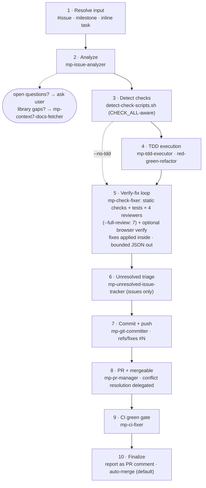

# mpx — Claude Code Customization Toolkit

Skills, agents, hooks, scripts, and instructions that extend [Claude Code](https://docs.anthropic.com/en/docs/claude-code) with a hands-off GitHub-driven pipeline (requirements → epic → issues → TDD execution → reviewed PR → CI-green auto-merge), benchmarked sub-agent pins, guard-rail hooks, custom status lines, and dozens of cherry-pickable dev skills.

## Workflow


- **HITL** label = issue needs human decisions; **AFK** label = implementable autonomously. `/mp-hitl` converts the former into the latter.
- **Bugs:** `/mp-bug-report` investigates root cause → TDD fix plan → labeled issue.
- **Standalone git:** `/mp-ship`, `/mp-commit-push-pr`, `/mp-pr` when implementation is already done.
- **Between sessions:** `/mp-handoff` saves context to `HANDOFF.md`.

### Execution pipeline (`/mp-execute`)

One GitHub issue (or inline task) per run. The main agent is a pure orchestrator — the review-fix, test-fix, and CI-fix loops run inside nested sub-agents that return bounded JSON, so raw findings, test failures, and CI logs never enter its context.



**Flags:** `--no-tdd` · `--full-review` · `--no-review` · `--no-auto-merge`.
TDD principles: [tests](skills/mp-execute/tests.md), [mocking](skills/mp-execute/mocking.md), [deep modules](skills/shared/deep-modules.md), [interface design](skills/shared/interface-design.md).

### Planning system (hybrid)

- **GitHub:** Milestones = versions/releases, Issues = epics (parent) + tasks (sub-issues with blocking), Project Board = tracking.
- **`.mpx/`:** `CONTEXT.md` (domain language, feature index, constraints) + `DECISIONS.md` (settled decisions with rationale). Format: `skills/shared/DOCUMENTATION_STRATEGY.md`. Tracked and committed — everything in it is team-shared; gitignore only `.mpx/tmp/`, the scratch area.

## Skills Reference

Most skills are `/`-only via `disable-model-invocation: true` and cost no context; only the few Claude must reach for unprompted stay model-invocable (their descriptions sit in every session's context). `/mp-ship` carries trigger phrasing for the whole git family. Conventions: `skills/shared/AUTHORING.md`.

### Planning

| Skill              | Description                                                                          |
| ------------------ | ------------------------------------------------------------------------------------ |
| `/mp-grill`        | Stress-test plan/design/requirements via relentless Q&A → CONTEXT.md + DECISIONS.md  |
| `/mp-grill-voice`  | mp-grill over JSON round files for the mobile voice app — answer by voice on a walk  |
| `/mp-to-epic`      | CONTEXT.md → epic as GitHub issue                                                    |
| `/mp-to-issues`    | Break epic into vertical-slice sub-issues (tasks)                                    |
| `/mp-hitl`         | Resolve HITL issues into AFK-ready by grilling decisions                             |
| `/mp-vocabulary`   | Maintain canonical domain terms in `.mpx/CONTEXT.md`                                 |
| `/mp-issue-create` | Create well-structured GitHub issues                                                 |
| `/mp-bug-report`   | Root cause → TDD fix plan → labeled bug issue                                        |
| `/mp-epic-review`  | epic-end review: code quality, architecture, cleanup, docs, unresolved items         |

### Execution & code quality

| Skill           | Description                                                                        |
| --------------- | ---------------------------------------------------------------------------------- |
| `/mp-execute`   | The execution orchestrator (pipeline above)                                        |
| `/mp-check-fix` | Detect and run check scripts, fix failures (`CHECK_ALL` first, else typecheck/lint/format/build) |
| `/mp-review`    | Unified code review — scope: PR, branch, changes; 4 or 7 parallel reviewers; optional autofix loop via `mp-executor` (≤3 iterations); findings → `REVIEW.md` |

### Board workflow (Obsidian)

Obsidian board notes (bugs/tasks with screenshots) → GitHub issues → autonomous batch fixes. Lanes (`To Process` → `Ready to implement` → `Manual testing` → `Archive`) are the state machine; the checkbox stays the user's manual-verification flag. Convention: `skills/shared/BOARD_CONVENTION.md`.

| Skill                 | Description                                                                 |
| --------------------- | --------------------------------------------------------------------------- |
| `/mp-board-setup`     | One-time: vault board + `.mpx/BOARD.md` symlink + `board-files` junction    |
| `/mp-board-to-issues` | `To Process` notes → labelled GitHub issues (merge, dedup, size, AFK/HITL)  |
| `/mp-batch-execute`   | Implement a batch of AFK issues on one branch → verify → one PR             |

### Testing

| Skill                 | Description                                                                     |
| --------------------- | ------------------------------------------------------------------------------- |
| `/mp-playwright-test` | Raw-Playwright visual verification over a scope — per-surface PASS/FAIL + screenshots |

Both it and `/mp-batch-execute`'s verify gate follow `skills/shared/PLAYWRIGHT_TESTING.md` (sanity-gate, assert-don't-eyeball, programmatic auth, never `networkidle`). The MCP-based `mp-chrome-devtools-tester` agent is for exploratory testing, perf traces, and Lighthouse only.

### Periodic maintenance

Run after milestones/epics. Sorted by attention required; all except the last two auto-fix and open a PR.

| Skill                     | Scope             | Attention | Notes                                             |
| ------------------------- | ----------------- | --------- | ------------------------------------------------- |
| `/mp-fallow-fix`          | Whole repo        | Low       | Auto-fixes dead code                              |
| `/mp-suppression-audit`   | Whole repo        | Low       | Audits eslint-disable, @ts-ignore, etc.           |
| `/mp-consolidate-context` | `.mpx/CONTEXT.md` | Low       | Dedup + tighten, fully automatic                  |
| `/mp-skill-audit`         | All skills        | Low       | Consistency rules, auto-fixes drift               |
| `/mp-harvest-decisions`   | Last 30d sessions | Low       | Transcripts → CONTEXT.md + DECISIONS.md           |
| `/mp-components-audit`    | Whole repo (UI)   | Medium    | Design-system drift; reports, `autofix` optional  |
| `/mp-code-clean`          | Whole repo        | Medium    | Dead code removal, deduplication                  |
| `/mp-decompose`           | Whole repo        | Medium    | Splits oversized files into modules               |
| `/mp-architecture-review` | Whole repo        | High      | Interactive — pain points, deepening candidates   |

### Design

Run in order: `init` (once) → `brief` → `mockup` → `refine`. Output under `designs/<component-name>/`. Contract: `skills/shared/DESIGN_PIPELINE.md`.

| Skill               | Description                                                              |
| ------------------- | ------------------------------------------------------------------------ |
| `/mp-design-init`   | Derive palette/fonts/density/motion → `designs/tokens.css` + system doc  |
| `/mp-design-brief`  | Component design brief; gates dependent issues with `Design needed`      |
| `/mp-mockup`        | N self-contained HTML variants (parallel `mp-ui-variant-generator`)      |
| `/mp-design-refine` | Apply refinements → `refined.html`, remove the design gate               |

### Git

| Skill                | Description                                                        |
| -------------------- | ------------------------------------------------------------------ |
| `/mp-commit`         | Stage and commit with conventional format                          |
| `/mp-commit-push`    | Commit and push (no PR)                                            |
| `/mp-pr`             | Create or update PR from existing commits                          |
| `/mp-commit-push-pr` | Commit, push, create/update PR                                     |
| `/mp-sync-base`      | Merge target branch into current branch                            |
| `/mp-ship`           | Sync base, commit, push, PR, watch CI green (`mp-ci-fixer`), merge |

### Setup & utility

| Skill                    | Description                                                           |
| ------------------------ | --------------------------------------------------------------------- |
| `/mp-setup-sveltekit`    | SvelteKit project from template with GitHub setup                     |
| `/mp-setup-react-native` | React Native monorepo from template with GitHub setup                 |
| `/mp-init-repo`          | Init git repo with .gitignore and .claude/ structure                  |
| `/mp-handoff`            | Save session progress to `HANDOFF.md`                                 |
| `/mp-continue`           | Recover interrupted sub-agent/background work, then continue          |
| `/mp-skill-create`       | Create new skills with structured conventions                         |
| `/mp-agent-create`       | Create new custom agents with structured conventions                  |
| `/mp-script-discovery`   | Discover runnable scripts and dev servers                             |
| `/mp-symlink`            | Windows symlinks/junctions the way that works in Claude Code          |
| `/mp-clean-pc`           | Full-disk cleanup sweep — ranked dashboard, quarantine over delete    |
| `/mp-raycast-config`     | Decrypt, audit and rewrite Raycast quicklinks, aliases and hotkeys    |
| `/mp-project-register`   | One colour → Windows Terminal profile, icon, dropdown group, Peacock, ports, quicklinks |

### Content generators

All output to `MPX_AI_GENERATED` subfolders.

| Skill                | Description                                                                     |
| -------------------- | ------------------------------------------------------------------------------- |
| `/mp-tutorial-create`| Compact markdown → interactive self-contained HTML tutorial (quizzes, Mermaid, CSS playground) |
| `/mp-podcast`        | Topic → two-host educational MP3 (parallel research, NotebookLM + Gemini TTS fallback) |
| `/mp-video-to-image` | YouTube video → printable one-page sheet image (`--mode exercise` or `generic`) |

Vendored: `/notebooklm` — third-party `notebooklm-py` CLI reference, pinned v0.7.3, edits belong upstream.

### Deprecated

Retired skills, agents, hooks and scripts are archived under [`deprecated/`](deprecated/) — never deleted.

## Agents

| Agent                       | Model  | Effort | Description                                                                 |
| --------------------------- | ------ | ------ | --------------------------------------------------------------------------- |
| Explore                     | Sonnet | Low    | **Overrides the built-in `Explore`** — read-only codebase search            |
| mp-executor                 | Opus   | Low    | Applies pre-analyzed edits to a scoped task chunk                           |
| mp-check-fixer              | Opus   | High   | Pre-commit gate: checks, reviewers, tests, optional browser verify; dispatches fixes |
| mp-ci-fixer                 | Opus   | High   | Fixes a failing CI run on a PR branch, pushes, re-watches                   |
| mp-issue-analyzer           | Opus   | High   | Analyzes issues and codebase, creates execution plans                       |
| mp-issue-finder             | Sonnet | Low    | Finds issue matching a PR branch                                            |
| mp-tdd-executor             | Opus   | Medium | Executes strict TDD red-green-refactor loops for behaviors                  |
| mp-ui-variant-generator     | Opus   | Medium | Generates a single UI variant for one layout angle                          |
| mp-chrome-devtools-tester   | Opus   | High   | Exploratory browser testing, perf traces and Lighthouse via chrome-devtools MCP |
| mp-checker                  | Haiku  | —      | Runs check commands and reports failures                                    |
| mp-context7-docs-fetcher    | Haiku  | —      | Fetches library docs via Context7 MCP                                       |
| mp-git-committer            | Haiku  | —      | Stages, commits, and optionally pushes with conventional commit format      |
| mp-pr-manager               | Sonnet | Low    | Creates or updates GitHub PRs with conventional title/body format           |
| mp-unresolved-issue-tracker | Sonnet | Low    | Routes unresolved implementation items to sibling issues or tracking issue  |
| mp-reviewer-* (7 agents)    | Sonnet | Medium | Best-practices, code-quality, error-handling, performance, security, spec-alignment, test-quality reviewers |
| mp-scanner-architecture     | Sonnet | Medium | Lightweight architecture scanner for epic-end review                        |

- Model and effort pins come from a July 2026 benchmark (80 sub-agents); the `Explore` agent overrides Claude Code's built-in to keep automatic explorations off Opus — rationale, findings, and gotchas in [`docs/SUBAGENTS.md`](docs/SUBAGENTS.md).
- Spawn rules (every rule tagged `TESTED`/`DOC`/`UNVERIFIED`): [`skills/shared/SUBAGENT_PROTOCOL.md`](skills/shared/SUBAGENT_PROTOCOL.md); the raw benchmark tables behind the `TESTED` verdicts live in [`docs/SUBAGENTS.md`](docs/SUBAGENTS.md).
- Reviewers share [`skills/shared/REVIEWER_PROTOCOL.md`](skills/shared/REVIEWER_PROTOCOL.md) and load language guides from `agents/references/` (TypeScript, React, Svelte 5, Python, Rust).

## Hooks

Configured via `settings.json`; auto-detect the project toolchain (`vite-plus` | `biome` | `classic`).

| Hook                         | Event                    | Description                                                        |
| ---------------------------- | ------------------------ | ------------------------------------------------------------------ |
| `enforce-pkg-mgr.js`         | PreToolUse (Bash)        | Blocks wrong package manager commands (detects from lockfile)      |
| `pre-commit-gate.js`         | PreToolUse (Bash)        | Runs `check:all` (Vite Plus) or typecheck before git commits       |
| `dangerous-command-guard.js` | PreToolUse (Bash)        | Blocks `rm -rf`, force-push to main, `git clean -fdx`, SQL DROP…   |
| `fallow-gate.js`             | PreToolUse (Bash)        | Blocks commit/push when the fallow audit verdict is fail           |
| `format-lint-file.js`        | PostToolUse (Edit/Write) | Auto-formats and lints edited files                                |
| `post-bash-context.js`       | PostToolUse (Bash)       | Enriches context after bash commands                               |
| `compact-instructions.js`    | PreCompact (*)           | Appends `instructions/COMPACT.md` to the compaction prompt (pi consumes the same file via `mpx-pi/extensions/compact-instructions.ts`) |
| `notify-flash-beep.ps1`      | Stop                     | Flashes taskbar + notification sound (custom: `~/.claude/sounds/notify.wav`) |
| `herdr-agent-state.ps1`      | SessionStart (*)         | Reports session state to herdr (no-op unless `HERDR_ENV=1`)        |
| `machine-paths.js`           | SessionStart (*)         | Surfaces the machine-root `MPX_*` environment variables into session context |

Test suites for the guard hooks live in `hooks/__tests__/`.

## Status Lines


**Main bar** (`scripts/status-line.mts`) — every element is a clickable OSC 8 link:

- Account badge (`P` personal / `W` work, colored to echo the pane tint) · session name · session id (opens the transcript `.jsonl`) · model · effort as a five-diamond gauge (`◆◆◆◇◇` = high)
- `project/worktree · branch` on one row, with `ports · MR/PR + review state · CI state` indented on the next (the path and branch can each run long and would push the rest off the right edge) — folder names open Explorer, glyphs beside them open VS Code or duplicate the tab there, the branch opens its page on the remote host, and dev-server ports (declared in `statusline-projects.json`) link to `localhost` and turn green while the server answers
- Branch state (`≡` in sync, `↑n`/`↓n`, staged/modified/untracked/conflicted counts, fetch age), indented and dim
- Context tokens with escalating color · bar filling toward the auto-compaction limit · session cost — with compaction history rows (`└─ auto · 205k → 15k · 06:50`) appearing once a session compacts
- 5-hour & 7-day quota bars with reset countdowns — read from stdin `rate_limits`, no network call
- Sub-agent ledger: every sub-agent that has **finished** this session — a `Σ` tally of tokens per model tier; when the rows below can't list every agent, a second line rolls up the agent types by count (`4×mp-executor 2×Explore`, the count always shown); then one row per agent with status · type · tier · effort gauge · elapsed · tokens · compaction counts. Failures always listed first, overflow collapses into `+N more`; a type name opens the `.claude/agents/<type>.md` that defines it, a status glyph opens that run's transcript, a red `!` marks a banned tier. The ledger is **pinned to the right** of the bar (from the first row — Claude Code moves its own `/rc` and queued-agent indicators below the bar when it fills the width) so it fills the gutter beside the short left rows instead of stacking below — falling back to stacked when the terminal is too narrow or `$COLUMNS` is unset

**Sub-agent panel** (`scripts/subagent-status-line.mts`, visible below the main bar whenever a sub-agent is running): one row per **running** sub-agent — status · model · effort gauge · elapsed · context · live progress label — plus a session-wide `Σ` tally. Rule violations (effort above `high`, or effort on haiku) get a red `!` on the offending cell with a reason line. The panel is the **live** view and the main bar's ledger is the **finished** view — an agent never appears in both.


More scenarios (many agents, worktree, light theme, drift, narrow terminal) live in the [status-line gallery](assets/gallery/).

**Account color** — `cc`/`ccw` repaint the terminal background before launching (`scripts/account-color.mts` + the tints in `statusline-accounts.json`: personal near-black faint-red, work dark blue; pi paints green from its own repo), so personal and work accounts are distinguishable at a glance while tab color stays free to mean *project*. The tint is dropped by any Windows Terminal settings reload and not re-emitted for a live pane, so the line-1 `P`/`W` badge is the tint-independent fallback. Both bars derive their whole palette from the Windows Terminal color scheme in `statusline-schemes.json`, with a contrast floor enforced per color — they follow scheme changes and invert correctly on a light theme.

### Installing the status lines

Both renderers are zero-dependency `.mts` files run by Node's native type stripping (Node ≥ 22.18, pinned in `package.json` `engines`). With the `scripts/` junction from the installation section below in place, wire them up in `settings.json`:

```json
"statusLine":         { "type": "command", "command": "node \"$HOME/.claude/scripts/status-line.mts\"" },
"subagentStatusLine": { "type": "command", "command": "node \"$HOME/.claude/scripts/subagent-status-line.mts\"" }
```

Verify changes with `node scripts/verify-statusline.mts` + `npx vitest run scripts/__tests__`. Design decisions, data sources, tab-title notes, and gotchas: [`docs/STATUS_LINE.md`](docs/STATUS_LINE.md).

## Installation — the repo is the live config

`~/.claude` doesn't hold copies of this repo — it holds **junctions and symlinks into it**. The
directories (`agents/`, `assets/`, `hooks/`, `instructions/`, `output-styles/`, `rules/`,
`scripts/`, `skills/`, `sounds/`, `templates/`) are junctions, and `CLAUDE.md`, `AGENTS.md`,
`settings.json`, `settings.local.json` are file symlinks. Editing the repo changes live behavior in every session immediately, and git
tracks every config change. The work account's `~/.claude-work` mirrors the same links, so both
accounts share one source of truth. Setup script, dual-account details, and Windows symlink
gotchas: [WINDOWS-SETUP.md](WINDOWS-SETUP.md).

Prerequisite: [Claude Code CLI](https://docs.anthropic.com/en/docs/claude-code) and
`git config --global core.symlinks true` (without it, git checkout silently replaces symlinks
with plain text files).

### Machine roots (`MPX_*`)

Personal absolute paths live in user-scope environment variables, not committed files. The [`machine-paths.js`](hooks/machine-paths.js) SessionStart hook injects whichever are set into every session; unset ones are skipped silently.

| Variable             | Root                    |
| -------------------- | ----------------------- |
| `MPX_PROJECTS`       | Personal projects       |
| `MPX_WORK`           | Work repositories       |
| `MPX_CLONED`         | Cloned OSS repositories |
| `MPX_APPS`           | Local apps              |
| `MPX_ONEDRIVE`       | OneDrive root           |
| `MPX_AI_GENERATED`   | Skill-generated assets  |
| `MPX_OBSIDIAN_VAULT` | Obsidian vault          |

```powershell
[Environment]::SetEnvironmentVariable('MPX_PROJECTS', 'C:\your\projects', 'User')
```

Markdown does not interpolate env vars, so sub-agents resolve them at runtime with `env | grep '^MPX_'`. Unset = unavailable — ask, do not guess.

## Global Instructions

[`instructions/AGENTS.md`](instructions/AGENTS.md) is the always-on rule file — working principles, sub-agent policy, preferences. Compaction-summary instructions live separately in [`instructions/COMPACT.md`](instructions/COMPACT.md): harness compaction prompts never see AGENTS.md, so the file is injected at compaction time instead — by the `compact-instructions.js` PreCompact hook here and by `mpx-pi/extensions/compact-instructions.ts` in pi — and costs no per-turn context. Response style lives in the `mp-terse` output style (`~/.claude/output-styles/mp-terse.md`, set via `outputStyle` in user settings) and is reinforced each turn by a `UserPromptSubmit` echo hook. Root `CLAUDE.md` and `AGENTS.md` are thin `@AGENTS.md` includes that pull it into every session, main agent and sub-agents alike (the repo `AGENTS.md` adds this repo's own skill-versioning rule on top); via the symlinks above it governs every repo on the machine. Agents with a bounded-JSON return contract (`mp-check-fixer`, `mp-ci-fixer`, `mp-git-committer`) follow their contract instead of its output-style rules.

## Settings

`settings.json` — env vars, MCP plugins, hooks, status line config. Installed to `~/.claude/settings.json`.

- **Context budget:** `autoCompactWindow` moves the auto-compaction trigger on the 1M model — it is an offset, not a fraction, and Claude Code silently skips auto-compaction below a hard floor. The current value lives in `settings.json`; the offset math is in [`docs/STATUS_LINE.md`](docs/STATUS_LINE.md).
- **MCP:** Context7 (library docs), TypeScript LSP, and rust-analyzer LSP enabled at user scope; the chrome-devtools plugin ships disabled in the tracked settings and is toggled on when a browser-testing session needs it. `ENABLE_TOOL_SEARCH: "auto:1"` keeps the per-session cost to tool names only.

## Templates & Scripts

| Template                         | Stack                                                       | GitHub                                                                              |
| -------------------------------- | ----------------------------------------------------------- | ----------------------------------------------------------------------------------- |
| `template-sveltekit`             | SvelteKit + Vite Plus + Drizzle + Vitest + Playwright       | [MartinoPolo/template-sveltekit](https://github.com/MartinoPolo/template-sveltekit) |
| `template-react-native-monorepo` | React + RN + Expo + Hono + Gluestack + NativeWind + Drizzle | [MartinoPolo/template-react-native-monorepo](https://github.com/MartinoPolo/template-react-native-monorepo) |

Both include the Vite Plus toolchain (OxLint + Oxfmt + tsgolint), ESLint gap rules, 80% coverage thresholds, `.claude/` + `.mpx/` structure, GitHub Actions CI.

**Worktrees:** `node scripts/setup-worktree.mts <name> [--base <ref>]` creates an isolated worktree — path derived from the repo location, base branch auto-detected, editor config + `.worktreeinclude` matches copied, per-worktree dev-server ports allocated, deps installed in the background; `remove-worktree.mts` releases the ports and cleans up. Harness-agnostic Node/TS hub (the `setup-worktree`/`remove-worktree` shell functions wrap it). Design, port model, and per-repo config: [`docs/WORKTREE_HUB.md`](docs/WORKTREE_HUB.md). The old bash creators live in [`scripts/deprecated/`](scripts/deprecated/).

**Tests:** `npm test` (Vitest) covers hooks, status-line and worktree scripts, and skill test suites.
