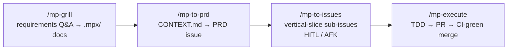
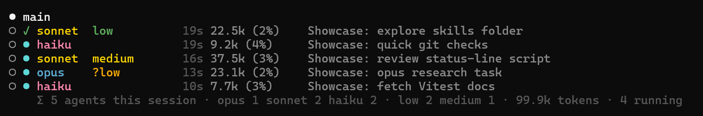

# mpx — Claude Code Customization Toolkit

Skills, agents, hooks, scripts, and instructions that extend [Claude Code](https://docs.anthropic.com/en/docs/claude-code) with GitHub-driven project workflows, TDD execution, and general-purpose dev tools.

**Why it's good:**

- **Full pipeline, hands-off** — requirements → PRD → GitHub issues → TDD execution → reviewed PR → CI-green auto-merge, with the main agent as a pure orchestrator (raw findings, test failures, and CI logs never enter its context).
- **Dozens of cherry-pickable skills and agents** — git workflows, parallel code review, design pipeline, maintenance sweeps, content generators (tutorials, podcasts, video sheets).
- **Benchmarked model/effort choices** — every agent's model and effort pin is backed by a measured benchmark, not vibes ([details](docs/SUBAGENTS.md)).
- **Guard-rail hooks** — wrong package manager, dangerous commands, unchecked commits all blocked before they run.
- **Custom status lines** — clickable, quota-aware main bar with a finished-sub-agent ledger + live per-sub-agent panel with rule-violation markers ([details](docs/STATUS_LINE.md)).

## Workflow



- **HITL** label = issue needs human decisions; **AFK** label = implementable autonomously. `/mp-hitl` converts the former into the latter.
- **Bugs:** `/mp-bug-report` investigates root cause → TDD fix plan → labeled issue.
- **Standalone git:** `/mp-ship`, `/mp-commit-push-pr`, `/mp-pr` when implementation is already done.
- **Between sessions:** `/mp-handoff` saves context to `HANDOFF.md`.

### Execution pipeline (`/mp-execute`)

One GitHub issue (or inline task) per run. The main agent is a pure orchestrator — the review-fix, test-fix, and CI-fix loops run inside nested sub-agents that return bounded JSON, so raw findings, test failures, and CI logs never enter its context.


**Flags:** `--no-tdd` · `--full-review` · `--no-review` · `--no-auto-merge`.
TDD principles: [tests](skills/mp-execute/tests.md), [mocking](skills/mp-execute/mocking.md), [deep modules](skills/shared/deep-modules.md), [interface design](skills/shared/interface-design.md).

### Planning system (hybrid)

- **GitHub:** Milestones = epics, Issues = tasks (PRDs + sub-issues with blocking), Project Board = tracking.
- **Local `.mpx/`:** `CONTEXT.md` (domain language, feature index, constraints) + `DECISIONS.md` (settled decisions with rationale). Format: `skills/shared/DOCUMENTATION_STRATEGY.md`.

## Skills Reference

Most skills are `/`-only via `disable-model-invocation: true` and cost no context; only the few Claude must reach for unprompted stay model-invocable (their descriptions sit in every session's context). `/mp-ship` carries trigger phrasing for the whole git family. Conventions: `skills/shared/AUTHORING.md`.

### Planning

| Skill              | Description                                                                          |
| ------------------ | ------------------------------------------------------------------------------------ |
| `/mp-grill`        | Stress-test plan/design/requirements via relentless Q&A → CONTEXT.md + DECISIONS.md  |
| `/mp-to-prd`       | CONTEXT.md → PRD as GitHub issue                                                     |
| `/mp-to-issues`    | Break PRD into vertical-slice sub-issues (HITL/AFK, blocking)                        |
| `/mp-hitl`         | Resolve HITL issues into AFK-ready by grilling decisions                             |
| `/mp-vocabulary`   | Maintain canonical domain terms in `.mpx/CONTEXT.md`                                 |
| `/mp-issue-create` | Create well-structured GitHub issues                                                 |
| `/mp-bug-report`   | Root cause → TDD fix plan → labeled bug issue                                        |
| `/mp-prd-review`   | PRD-end review: code quality, architecture, cleanup, docs, unresolved items          |

### Execution & code quality

| Skill           | Description                                                                        |
| --------------- | ---------------------------------------------------------------------------------- |
| `/mp-execute`   | The execution orchestrator (pipeline above)                                        |
| `/mp-check-fix` | Detect and run check scripts, fix failures (`CHECK_ALL` first, else typecheck/lint/format/build) |
| `/mp-review`    | Unified code review — scope: PR, branch, changes; 4 or 7 parallel reviewers; optional autofix loop via `mp-executor` (≤3 iterations); findings → `REVIEW.md` |

### Board workflow (Obsidian)

Obsidian board notes (bugs/tasks with screenshots) → GitHub issues → autonomous batch fixes. Lanes (`To Process` → `Ready to implement` → `Manual testing` → `Archive`) are the state machine; the checkbox stays the user's manual-verification flag. Convention: `skills/shared/BOARD_CONVENTION.md`.

| Skill                 | Description                                                                 |
| --------------------- | --------------------------------------------------------------------------- |
| `/mp-board-setup`     | One-time: vault board + `.mpx/BOARD.md` symlink + `board-files` junction    |
| `/mp-board-to-issues` | `To Process` notes → labelled GitHub issues (merge, dedup, size, AFK/HITL)  |
| `/mp-batch-execute`   | Implement a batch of AFK issues on one branch → verify → one PR             |

### Testing

| Skill                 | Description                                                                     |
| --------------------- | ------------------------------------------------------------------------------- |
| `/mp-playwright-test` | Raw-Playwright visual verification over a scope — per-surface PASS/FAIL + screenshots |

Both it and `/mp-batch-execute`'s verify gate follow `skills/shared/PLAYWRIGHT_TESTING.md` (sanity-gate, assert-don't-eyeball, programmatic auth, never `networkidle`). The MCP-based `mp-chrome-devtools-tester` agent is for exploratory testing, perf traces, and Lighthouse only.

### Periodic maintenance

Run after milestones/PRDs. Sorted by attention required; all except the last two auto-fix and open a PR.

| Skill                     | Scope             | Attention | Notes                                             |
| ------------------------- | ----------------- | --------- | ------------------------------------------------- |
| `/mp-fallow-fix`          | Whole repo        | Low       | Auto-fixes dead code                              |
| `/mp-suppression-audit`   | Whole repo        | Low       | Audits eslint-disable, @ts-ignore, etc.           |
| `/mp-consolidate-context` | `.mpx/CONTEXT.md` | Low       | Dedup + tighten, fully automatic                  |
| `/mp-skill-audit`         | All skills        | Low       | 15 consistency rules, auto-fixes drift            |
| `/mp-harvest-decisions`   | Last 30d sessions | Low       | Transcripts → CONTEXT.md + DECISIONS.md           |
| `/mp-components-audit`    | Whole repo (UI)   | Medium    | Design-system drift; reports, `autofix` optional  |
| `/mp-code-clean`          | Whole repo        | Medium    | Dead code removal, deduplication                  |
| `/mp-decompose`           | Whole repo        | Medium    | Splits oversized files into modules               |
| `/mp-architecture-review` | Whole repo        | High      | Interactive — pain points, deepening candidates   |

### Design

Run in order: `init` (once) → `brief` → `mockup` → `refine`. Output under `designs/<component-name>/`. Contract: `skills/shared/DESIGN_PIPELINE.md`.

| Skill               | Description                                                              |
| ------------------- | ------------------------------------------------------------------------ |
| `/mp-design-init`   | Derive palette/fonts/density/motion → `designs/tokens.css` + system doc  |
| `/mp-design-brief`  | Component design brief; gates dependent issues with `Design needed`      |
| `/mp-mockup`        | N self-contained HTML variants (parallel `mp-ui-variant-generator`)      |
| `/mp-design-refine` | Apply refinements → `refined.html`, remove the design gate               |

### Git

| Skill                | Description                                                        |
| -------------------- | ------------------------------------------------------------------ |
| `/mp-commit`         | Stage and commit with conventional format                          |
| `/mp-commit-push`    | Commit and push (no PR)                                            |
| `/mp-pr`             | Create or update PR from existing commits                          |
| `/mp-commit-push-pr` | Commit, push, create/update PR                                     |
| `/mp-sync-base`      | Merge target branch into current branch                            |
| `/mp-ship`           | Sync base, commit, push, PR, watch CI green (`mp-ci-fixer`), merge |

### Setup & utility

| Skill                    | Description                                                           |
| ------------------------ | --------------------------------------------------------------------- |
| `/mp-setup-sveltekit`    | SvelteKit project from template with GitHub setup                     |
| `/mp-setup-react-native` | React Native monorepo from template with GitHub setup                 |
| `/mp-init-repo`          | Init git repo with .gitignore and .claude/ structure                  |
| `/mp-handoff`            | Save session progress to `HANDOFF.md`                                 |
| `/mp-continue`           | Recover interrupted sub-agent/background work, then continue          |
| `/mp-skill-create`       | Create new skills with structured conventions                         |
| `/mp-agent-create`       | Create new custom agents with structured conventions                  |
| `/mp-script-discovery`   | Discover runnable scripts and dev servers                             |
| `/mp-symlink`            | Windows symlinks/junctions the way that works in Claude Code          |
| `/mp-clean-pc`           | Full-disk cleanup sweep — ranked dashboard, quarantine over delete    |
| `/mp-raycast-config`     | Decrypt, audit and rewrite Raycast quicklinks, aliases and hotkeys    |

### Content generators

All output to `MPX_AI_GENERATED` subfolders.

| Skill                | Description                                                                     |
| -------------------- | ------------------------------------------------------------------------------- |
| `/mp-tutorial-create`| Compact markdown → interactive self-contained HTML tutorial (quizzes, Mermaid, CSS playground) |
| `/mp-podcast`        | Topic → two-host educational MP3 (parallel research, NotebookLM + Gemini TTS fallback) |
| `/mp-video-to-image` | YouTube video → printable one-page sheet image (`--mode exercise` or `generic`) |

Vendored: `/notebooklm` — third-party `notebooklm-py` CLI reference, pinned v0.7.3, edits belong upstream.

### Deprecated

Retired skills, agents, hooks and scripts are archived under [`deprecated/`](deprecated/) — never deleted. Includes the pre-pipeline design skill (`/mp-design-ui-3` and its 18-style catalog), the superseded grill/requirements skills, and the bash status-line originals.

## Agents

| Agent                       | Model  | Effort | Description                                                                 |
| --------------------------- | ------ | ------ | --------------------------------------------------------------------------- |
| Explore                     | Sonnet | Low    | **Overrides the built-in `Explore`** — read-only codebase search            |
| mp-executor                 | Opus   | Low    | Applies pre-analyzed edits to a scoped task chunk                           |
| mp-check-fixer              | Opus   | High   | Pre-commit gate: checks, reviewers, tests, optional browser verify; dispatches fixes |
| mp-ci-fixer                 | Opus   | High   | Fixes a failing CI run on a PR branch, pushes, re-watches                   |
| mp-issue-analyzer           | Opus   | High   | Analyzes issues and codebase, creates execution plans                       |
| mp-issue-finder             | Sonnet | Low    | Finds issue matching a PR branch                                            |
| mp-tdd-executor             | Opus   | Medium | Executes strict TDD red-green-refactor loops for behaviors                  |
| mp-ui-variant-generator     | Opus   | Medium | Generates a single UI variant for one layout angle                          |
| mp-chrome-devtools-tester   | Opus   | High   | Exploratory browser testing, perf traces and Lighthouse via chrome-devtools MCP |
| mp-checker                  | Haiku  | —      | Runs check commands and reports failures                                    |
| mp-context7-docs-fetcher    | Haiku  | —      | Fetches library docs via Context7 MCP                                       |
| mp-git-committer            | Haiku  | —      | Stages, commits, and optionally pushes with conventional commit format      |
| mp-pr-manager               | Sonnet | Low    | Creates or updates GitHub PRs with conventional title/body format           |
| mp-unresolved-issue-tracker | Sonnet | Low    | Routes unresolved implementation items to sibling issues or tracking issue  |
| mp-reviewer-* (7 agents)    | Sonnet | Medium | Best-practices, code-quality, error-handling, performance, security, spec-alignment, test-quality reviewers |
| mp-scanner-architecture     | Sonnet | Medium | Lightweight architecture scanner for PRD-end review                         |

- Model and effort pins come from a July 2026 benchmark (80 sub-agents); the `Explore` agent overrides Claude Code's built-in to keep automatic explorations off Opus — rationale, findings, and gotchas in [`docs/SUBAGENTS.md`](docs/SUBAGENTS.md).
- Spawn rules (every rule tagged `TESTED`/`DOC`/`UNVERIFIED`): [`skills/shared/SUBAGENT_PROTOCOL.md`](skills/shared/SUBAGENT_PROTOCOL.md).
- Reviewers share [`skills/shared/REVIEWER_PROTOCOL.md`](skills/shared/REVIEWER_PROTOCOL.md) and load language guides from `agents/references/` (TypeScript, React, Svelte 5, Python, Rust).

## Hooks

Configured via `settings.json`; auto-detect the project toolchain (`vite-plus` | `biome` | `classic`).

| Hook                         | Event                    | Description                                                        |
| ---------------------------- | ------------------------ | ------------------------------------------------------------------ |
| `enforce-pkg-mgr.js`         | PreToolUse (Bash)        | Blocks wrong package manager commands (detects from lockfile)      |
| `pre-commit-gate.js`         | PreToolUse (Bash)        | Runs `check:all` (Vite Plus) or typecheck before git commits       |
| `dangerous-command-guard.js` | PreToolUse (Bash)        | Blocks `rm -rf`, force-push to main, `git clean -fdx`, SQL DROP…   |
| `fallow-gate.js`             | PreToolUse (Bash)        | Blocks commit/push when the fallow audit verdict is fail           |
| `format-lint-file.js`        | PostToolUse (Edit/Write) | Auto-formats and lints edited files                                |
| `post-bash-context.js`       | PostToolUse (Bash)       | Enriches context after bash commands                               |
| `notify-flash-beep.ps1`      | Stop                     | Flashes taskbar + notification sound (custom: `~/.claude/sounds/notify.wav`) |
| `herdr-agent-state.ps1`      | SessionStart (*)         | Reports session state to herdr (no-op unless `HERDR_ENV=1`)        |
| `machine-paths.js`           | SessionStart (*)         | Surfaces the machine-root `MPX_*` environment variables into session context |

Test suites for the guard hooks live in `hooks/__tests__/`.

## Status Lines


**Main bar** (`scripts/status-line.mts`):

- Account · session name (bold magenta) · session id, linked to the session's transcript `.jsonl`
- Model (`Opus 5 (1M)`) · effort as a five-diamond gauge (`◆◆◆◇◇` = high)
- `project 󰨞/worktree 󰨞 · branch · :8100 󰏫 · MR/PR + review state · CI state` — branch and editor carry Nerd Font glyphs (`Cascadia Mono, Symbols Nerd Font` fallback pair in Windows Terminal), project and worktree names open their own folders in Explorer, the VS Code glyph beside each name opens the editor there, the branch name opens `…/tree/<branch>` on its remote host, dev-server ports (declared per project in `statusline-projects.json`) link to `localhost` over whichever scheme the server actually speaks (http or https) and turn green while it answers, and a dim pencil (or a `󰏫 ports` hint when nothing is configured) opens that config
- Branch state, indented and dim: `≡` in sync (or `↑n`/`↓n`, the unpushed count linking to the `<default>...<branch>` compare view), `+n` staged, `!n` modified, `?n` untracked, `~n` conflicted · fetch age — color only for states git decides (diverged, conflicts, deleted remote)
- Context tokens with escalating color · bar filling toward the auto-compaction limit · session cost (USD/CZK)
- Compaction history, one indented row per event: `└─ auto · 205k → 15k · 06:50`. `auto` is amber, `manual` grey, the clock dim; the last 3 are spelled out and older ones collapse into a `N earlier` count. Absent entirely until a session compacts
- 5-hour & 7-day quota bars with reset countdowns — from stdin `rate_limits`, no network call; the `5h`/`7d` labels link to the claude.ai usage dashboard
- Sub-agent history, the last block so it sits directly above the panel — every sub-agent that has **finished** this session, long after the panel below has evicted it:
  ```
  Σ 8 agents · 5×Opus 612.4k 3×Sonnet 183.1k · 4×mp-executor 2×Explore !fork
  ⠀ × fork           !fable ◆◆◆◇◇  1m09s   77.6k
  ⠀ ✓ mp-executor     opus   ◆◆◇◇◇  4m02s  231.4k  2×auto
  ⠀ ✓ Explore         sonnet ◆◇◇◇◇     12s   95.2k
  ⠀ +3 more
  ```
  A tally row with tokens charged per tier, then one row per agent — status · type · tier · effort gauge · elapsed · tokens · compaction counts (`2×auto` amber, `1×manual` grey; silent when it never compacted). **Five rows plus every failure**, failures always first: up to five agents keep spawn order, past five they rank by tokens, largest first, and the remainder become `+N more`. Agent types come from the `agent-<id>.meta.json` sidecars Claude Code writes at spawn; a **type name opens the `.claude/agents/<type>.md` that defines it** (project-level first, then user-level, no link for a built-in nobody overrode) while a row's **status glyph opens that run's own transcript**. A red `!` marks a banned tier. Absent until the first agent finishes

**Sub-agent panel** (`scripts/subagent-status-line.mts`, visible below the main bar whenever a sub-agent is running): one row per sub-agent — status · model · effort as the main bar's `◆◆◆◇◇` gauge · elapsed · context · live progress label — plus a session-wide `Σ` tally. Sub-agents compact independently and each writes its own transcript, so a row that compacted carries the same indented history beneath it. Rule violations (`fable`, effort above `high`, effort on haiku) get a red `!` on the offending cell with a reason line. The panel is the **live** view and the main bar's `Σ` row is the **ledger** — running agents appear in one, finished agents in the other, never both.



Both are zero-dependency `.mts` run by Node's native type stripping (≥ 22.18) — ported from bash for a ~3.5× render speedup. Verify changes with `node scripts/verify-statusline.mts` + `npx vitest run scripts/__tests__`. All design decisions, mechanics, and gotchas: [`docs/STATUS_LINE.md`](docs/STATUS_LINE.md).

## Installation — the repo is the live config

`~/.claude` doesn't hold copies of this repo — it holds **junctions and symlinks into it**. The
directories (`agents/`, `skills/`, `hooks/`, `scripts/`, `instructions/`, `rules/`, `sounds/`,
`templates/`) are junctions, and `CLAUDE.md`, `AGENTS.md`, `settings.json`, `settings.local.json`
are file symlinks. Editing the repo changes live behavior in every session immediately, and git
tracks every config change. The work account's `~/.claude-work` mirrors the same links, so both
accounts share one source of truth. Setup script, dual-account details, and Windows symlink
gotchas: [WINDOWS-SETUP.md](WINDOWS-SETUP.md).

Prerequisite: [Claude Code CLI](https://docs.anthropic.com/en/docs/claude-code) and
`git config --global core.symlinks true` (without it, git checkout silently replaces symlinks
with plain text files).

### Machine roots (`MPX_*`)

Personal absolute paths live in user-scope environment variables, not committed files. The [`machine-paths.js`](hooks/machine-paths.js) SessionStart hook injects whichever are set into every session; unset ones are skipped silently.

| Variable             | Root                    |
| -------------------- | ----------------------- |
| `MPX_PROJECTS`       | Personal projects       |
| `MPX_WORK`           | Work repositories       |
| `MPX_CLONED`         | Cloned OSS repositories |
| `MPX_APPS`           | Local apps              |
| `MPX_ONEDRIVE`       | OneDrive root           |
| `MPX_AI_GENERATED`   | Skill-generated assets  |
| `MPX_OBSIDIAN_VAULT` | Obsidian vault          |

```powershell
[Environment]::SetEnvironmentVariable('MPX_PROJECTS', 'C:\your\projects', 'User')
```

Markdown does not interpolate env vars, so sub-agents resolve them at runtime with `env | grep '^MPX_'`. Unset = unavailable — ask, do not guess.

## Global Instructions

[`instructions/AGENTS.md`](instructions/AGENTS.md) is the always-on rule file — output style, sub-agent policy, preferences, compaction rules. Root `CLAUDE.md` and `AGENTS.md` are one-line `@AGENTS.md` includes that pull it into every session, main agent and sub-agents alike; via the symlinks above it governs every repo on the machine. Agents with a bounded-JSON return contract (`mp-check-fixer`, `mp-ci-fixer`, `mp-git-committer`) follow their contract instead of its output-style rules.

## Settings

`settings.json` — env vars, MCP plugins, hooks, status line config. Installed to `~/.claude/settings.json`.

- **Context budget:** `autoCompactWindow: 213000` → auto-compaction fires at **180k tokens used** on the 1M model. 200k is a hard floor (below it Claude Code silently skips auto-compaction); the fixed 33k of deductions makes 213000 the number.
- **MCP:** Context7 (library docs), TypeScript LSP, chrome-devtools at user scope (per-agent `mcpServers:` frontmatter measured inert on 2.1.212). `ENABLE_TOOL_SEARCH: "auto:1"` keeps the cost to tool names only (~260 tokens).

## Templates & Scripts

| Template                         | Stack                                                       | GitHub                                                                              |
| -------------------------------- | ----------------------------------------------------------- | ----------------------------------------------------------------------------------- |
| `template-sveltekit`             | SvelteKit + Vite Plus + Drizzle + Vitest + Playwright       | [MartinoPolo/template-sveltekit](https://github.com/MartinoPolo/template-sveltekit) |
| `template-react-native-monorepo` | React + RN + Expo + Hono + Gluestack + NativeWind + Drizzle | [MartinoPolo/template-react-native-monorepo](https://github.com/MartinoPolo/template-react-native-monorepo) |

Both include the Vite Plus toolchain (OxLint + Oxfmt + tsgolint), ESLint gap rules, 80% coverage thresholds, `.claude/` + `.mpx/` structure, GitHub Actions CI.

**Worktrees:** `bash scripts/setup-worktree.sh <name>` creates an isolated worktree and copies IDE configs, `.env` files, `.claude/settings.local.json`, gitignored `.mpx/`, then installs deps; `remove-worktree.sh` cleans up.

**Tests:** `npm test` (Vitest) covers hooks and status-line scripts.
