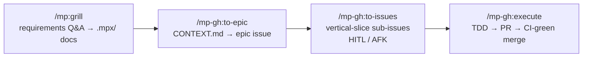

# mp — a Claude Code plugin

Skills, agents, hooks, scripts, and instructions that extend [Claude Code](https://docs.anthropic.com/en/docs/claude-code) with GitHub-driven project workflows, TDD execution, and general-purpose dev tools. This repo is a **marketplace of two plugins**: the tracker-neutral **`mp`** (skills, agents, hooks, status line — everything not coupled to a specific issue tracker) and **`mp-gh`**, a GitHub layer on top of it (issue/PR/epic workflow skills and agents). The neutral `mp` plugin can be paired with a different tracker plugin (the author runs a private KanbanFlow/GitLab `kf` plugin on a second account); `mp-gh` is the GitHub pairing. See [Repository layout](#repository-layout-two-plugins).

**Features:**

- **Full pipeline, hands-off** — requirements → epic → GitHub issues → TDD execution → reviewed PR → CI-green auto-merge, with the main agent as a pure orchestrator (raw findings, test failures, and CI logs never enter its context).
- **Dozens of cherry-pickable skills and agents** — git workflows, parallel code review, design pipeline, maintenance sweeps, content generators (tutorials, podcasts, video sheets).
- **Benchmarked model/effort choices** — every agent's model and effort pin is backed by a measured benchmark, not vibes ([details](docs/SUBAGENTS.md)).
- **Guard-rail hooks** — wrong package manager, dangerous commands, unchecked commits all blocked before they run.
- **Custom status lines** — clickable, quota-aware main bar with a finished-sub-agent ledger + live per-sub-agent panel with rule-violation markers ([details](docs/STATUS_LINE.md)). Requires a short manual setup step — see [Manual setup](#manual-setup-not-pluginnable) below.

## Repository layout (two plugins)

```
mpx-claude-code/
├─ .claude-plugin/marketplace.json   lists both plugins
├─ plugins/
│  ├─ mp/    → /mp:<name>      tracker-neutral: skills, agents, hooks,
│  │                           output-styles, scripts, status line, shared docs
│  └─ gh/    → /mp-gh:<name>   GitHub layer: issue/PR/epic skills + agents
└─ docs · instructions · rules · templates · local · README   (repo-level, not plugins)
```

A plugin's `name` supplies its slash prefix, and two plugins cannot share one — that is why the GitHub-coupled skills live in their own `mp-gh` plugin rather than as folders inside `mp`. The neutral `mp` plugin is meant to be paired, per account, with whichever tracker layer fits: `mp-gh` for GitHub, or a separate tracker plugin elsewhere.

**Cross-plugin references:** `mp-gh` skills reuse neutral shared docs and scripts that live in `mp` (e.g. `GIT_COMMIT_WORKFLOW.md`, `detect-check-scripts.mjs`). Because `--plugin-dir` loads each plugin in place and **skips any symlink resolving outside the plugin folder**, cross-plugin links are written as a relative hop off the plugin root — `${CLAUDE_PLUGIN_ROOT}/../mp/skills/shared/<file>` and `${CLAUDE_PLUGIN_ROOT}/../mp/scripts/<file>` — which resolves only when both plugins sit side by side under `plugins/` and are loaded from source (the supported per-account setup below). A marketplace install that copied one plugin without the other would break this hop.

## Install

### Marketplace

```
/plugin marketplace add MartinoPolo/mpx-claude-code
/plugin install mp@mp
/plugin install mp-gh@mp
```

The first command registers this repo as a marketplace (it lists two plugins, `mp` and `mp-gh`, sourced from `./plugins/mp` and `./plugins/gh`); the next two install them. Installing `mp` ships the neutral skills, agents, hooks, and `output-styles/`; `mp-gh` adds the GitHub skills and agents. Neither touches your `settings.json` — see [Manual setup](#manual-setup-not-pluginnable) for the status line, default model, and output style.

### Local development / per-account loading (recommended)

The author does not marketplace-install locally — a marketplace install copies each plugin into a versioned cache and kills live edits. Instead each account's launcher loads the plugins straight from the working copy with repeated `--plugin-dir` flags:

```
# personal account: neutral + GitHub
claude --plugin-dir <clone>/plugins/mp --plugin-dir <clone>/plugins/gh

# a second account can pair the neutral plugin with a different tracker plugin
claude --plugin-dir <clone>/plugins/mp --plugin-dir <other-tracker-plugin>
```

`--plugin-dir` loads a plugin live, in place — no copy step, and it is what makes the cross-plugin `../mp` hop above resolve. After editing a hook or agent file run `/reload-plugins`; `SKILL.md` edits apply immediately. The full Windows two-account launcher setup is in [`WINDOWS-SETUP.md`](WINDOWS-SETUP.md).

### Invocation

Neutral skills invoke as `/mp:<name>` (for example `/mp:review`, `/mp:grill`); GitHub skills invoke as `/mp-gh:<name>` (for example `/mp-gh:execute`, `/mp-gh:ship`, `/mp-gh:to-issues`). Each plugin's name supplies its namespace prefix automatically. In the skill tables below the prefix shown is the plugin the skill ships in.

## Workflow



- **HITL** label = issue needs human decisions; **AFK** label = implementable autonomously. `/mp-gh:hitl` converts the former into the latter.
- **Bugs:** `/mp:bug-report` investigates root cause → TDD fix plan → labeled issue.
- **Standalone git:** `/mp-gh:ship`, `/mp-gh:commit-push-pr`, `/mp-gh:pr` when implementation is already done.
- **Between sessions:** `/mp:handoff` saves context to `HANDOFF.md`.

### Execution pipeline (`/mp-gh:execute`)

One GitHub issue (or inline task) per run. The main agent is a pure orchestrator — the review-fix, test-fix, and CI-fix loops run inside nested sub-agents that return bounded JSON, so raw findings, test failures, and CI logs never enter its context.


**Flags:** `--no-tdd` · `--full-review` · `--no-review` · `--no-auto-merge`.
TDD principles: [tests](plugins/gh/skills/mp-execute/tests.md), [mocking](plugins/gh/skills/mp-execute/mocking.md), [deep modules](plugins/mp/skills/shared/deep-modules.md), [interface design](plugins/mp/skills/shared/interface-design.md).

### Planning system (hybrid)

- **GitHub:** Milestones = versions/releases, Issues = epics (parent) + tasks (sub-issues with blocking), Project Board = tracking.
- **`.mpx/`:** `CONTEXT.md` (domain language, feature index, constraints) + `DECISIONS.md` (settled decisions with rationale). Format: `plugins/mp/skills/shared/DOCUMENTATION_STRATEGY.md`. Tracked and committed — everything in it is team-shared; gitignore only `.mpx/tmp/`, the scratch area.

## Skills reference

Skills below ship in one of the two plugins — the prefix on each row tells you which: `/mp:<name>` for the neutral `mp` plugin (installed under `plugins/mp/skills/`), `/mp-gh:<name>` for the GitHub `mp-gh` plugin (`plugins/gh/skills/`). Most skills are `/`-only via `disable-model-invocation: true` and cost no context; only the few Claude must reach for unprompted stay model-invocable (their descriptions sit in every session's context). `/mp-gh:ship` carries trigger phrasing for the whole git family. Conventions: `plugins/mp/skills/shared/AUTHORING.md`. Personal, non-shipped skills are covered separately under [Local skills](#local-skills-not-installed).

### Planning

| Skill              | Description                                                                          |
| ------------------ | ------------------------------------------------------------------------------------ |
| `/mp:grill`        | Stress-test plan/design/requirements via relentless Q&A → CONTEXT.md + DECISIONS.md  |
| `/mp:grill-voice`  | `mp-grill` over JSON round files for the mobile voice app — answer by voice on a walk |
| `/mp-gh:to-epic`   | CONTEXT.md → epic as GitHub issue                                                    |
| `/mp-gh:to-issues` | Break epic into vertical-slice sub-issues (tasks)                                    |
| `/mp-gh:hitl`      | Resolve HITL issues into AFK-ready by grilling decisions                             |
| `/mp:vocabulary`   | Maintain canonical domain terms in `.mpx/CONTEXT.md`                                 |
| `/mp-gh:issue-create` | Create well-structured GitHub issues                                              |
| `/mp:bug-report`   | Root cause → TDD fix plan → labeled bug issue                                        |
| `/mp-gh:epic-review` | epic-end review: code quality, architecture, cleanup, docs, unresolved items       |

### Execution & code quality

| Skill           | Description                                                                        |
| --------------- | ----------------------------------------------------------------------------------- |
| `/mp-gh:execute` | The execution orchestrator (pipeline above)                                        |
| `/mp:check-fix` | Detect and run check scripts, fix failures (`CHECK_ALL` first, else typecheck/lint/format/build) |
| `/mp:review`    | Unified code review — scope: PR, branch, changes; 4 or 7 parallel reviewers; optional autofix loop via `mp-executor` (≤3 iterations); findings → `REVIEW.md` |

### Board workflow (Obsidian)

Obsidian board notes (bugs/tasks with screenshots) → GitHub issues → autonomous batch fixes. Lanes (`To Process` → `Ready to implement` → `Manual testing` → `Archive`) are the state machine; the checkbox stays the user's manual-verification flag. Convention: `plugins/mp/skills/shared/BOARD_CONVENTION.md`. The board setup and note-conversion steps (`mp-board-setup`, `mp-board-to-issues`) are personal-workflow skills under [Local skills](#local-skills-not-installed); the batch-execution step below ships with the plugin.

| Skill                 | Description                                                                 |
| --------------------- | ---------------------------------------------------------------------------- |
| `/mp-gh:batch-execute` | Implement a batch of AFK issues on one branch → verify → one PR            |

### Testing

| Skill                 | Description                                                                     |
| --------------------- | ---------------------------------------------------------------------------------- |
| `/mp:playwright-test` | Raw-Playwright visual verification over a scope — per-surface PASS/FAIL + screenshots |

Both it and `/mp-gh:batch-execute`'s verify gate follow `plugins/mp/skills/shared/PLAYWRIGHT_TESTING.md` (sanity-gate, assert-don't-eyeball, programmatic auth, never `networkidle`). The MCP-based `mp-chrome-devtools-tester` agent is for exploratory testing, perf traces, and Lighthouse only.

### Periodic maintenance

Run after milestones/epics. Sorted by attention required; all except the last two auto-fix and open a PR.

| Skill                     | Scope             | Attention | Notes                                             |
| ------------------------- | ----------------- | --------- | ------------------------------------------------- |
| `/mp:fallow-fix`          | Whole repo        | Low       | Auto-fixes dead code                              |
| `/mp:suppression-audit`   | Whole repo        | Low       | Audits eslint-disable, @ts-ignore, etc.           |
| `/mp:consolidate-context` | `.mpx/CONTEXT.md` | Low       | Dedup + tighten, fully automatic                  |
| `/mp:skill-audit`         | All skills        | Low       | Consistency rules, auto-fixes drift               |
| `/mp:harvest-decisions`   | Recent sessions   | Low       | Transcripts → CONTEXT.md + DECISIONS.md           |
| `/mp:components-audit`    | Whole repo (UI)   | Medium    | Design-system drift; reports, `autofix` optional  |
| `/mp:code-clean`          | Whole repo        | Medium    | Dead code removal, deduplication                  |
| `/mp:decompose`           | Whole repo        | Medium    | Splits oversized files into modules               |
| `/mp:architecture-review` | Whole repo        | High      | Interactive — pain points, deepening candidates   |

### Design

Run in order: `init` (once) → `brief` → `mockup` → `refine`. Output under `designs/<component-name>/`. Contract: `plugins/mp/skills/shared/DESIGN_PIPELINE.md`.

| Skill               | Description                                                              |
| ------------------- | ------------------------------------------------------------------------ |
| `/mp:design-init`   | Derive palette/fonts/density/motion → `designs/tokens.css` + system doc  |
| `/mp:design-brief`  | Component design brief; gates dependent issues with `Design needed`      |
| `/mp:mockup`        | N self-contained HTML variants (parallel `mp-ui-variant-generator`)      |
| `/mp:design-refine` | Apply refinements → `refined.html`, remove the design gate               |

### Git

| Skill                | Description                                                        |
| -------------------- | ------------------------------------------------------------------ |
| `/mp:commit`         | Stage and commit with conventional format                          |
| `/mp:commit-push`    | Commit and push (no PR)                                            |
| `/mp-gh:pr`          | Create or update PR from existing commits                          |
| `/mp-gh:commit-push-pr` | Commit, push, create/update PR                                  |
| `/mp:sync-base`      | Merge target branch into current branch                            |
| `/mp-gh:ship`        | Sync base, commit, push, PR, watch CI green (`mp-ci-fixer`), merge |

### Setup & utility

| Skill                    | Description                                                           |
| ------------------------ | ----------------------------------------------------------------------- |
| `/mp-gh:setup-sveltekit`    | SvelteKit project from template with GitHub setup                  |
| `/mp-gh:setup-react-native` | React Native monorepo from template with GitHub setup              |
| `/mp-gh:init-repo`          | Init git repo with .gitignore and .claude/ structure               |
| `/mp:handoff`            | Save session progress to `HANDOFF.md`                                 |
| `/mp:continue`           | Recover interrupted sub-agent/background work, then continue          |
| `/mp:skill-create`       | Create new skills with structured conventions                         |
| `/mp:agent-create`       | Create new custom agents with structured conventions                  |
| `/mp:script-discovery`   | Discover runnable scripts and dev servers                             |
| `/mp:symlink`            | Windows symlinks/junctions the way that works in Claude Code          |

### Vendored reference

| Skill            | Description                                                                          |
| ---------------- | ------------------------------------------------------------------------------------- |
| `/mp:notebooklm` | Third-party `notebooklm-py` CLI reference, pinned to a fixed release; edits belong upstream |

Used by the `mp-podcast` skill under [Local skills](#local-skills-not-installed).

### Deprecated

Retired skills, agents, hooks and scripts are archived under [`deprecated/`](deprecated/) — never deleted. Includes the pre-pipeline design skill (`mp-design-ui-3` and its style catalog), the superseded grill/requirements skills, and the bash status-line originals.

## Local skills (not installed)

`local/skills/` holds personal and example skills that live **outside** the plugin's `skills/` scan — installing `mp` via the marketplace does not install these. They're kept in the repo for reference and as a showcase of what's possible; cherry-pick by copying a folder into your own skill directory (classic `~/.claude/skills/`, a project's `.claude/skills/`, or a separate `--plugin-dir`). Their `SKILL.md` files keep the `mp-` prefix in their `name:` field, so once installed outside this plugin they invoke under their own name (e.g. `/mp-podcast`) rather than the `/mp:` namespace.

Several depend on the [machine-root environment variables](#machine-roots-mpx_) below, and a couple assume a Windows workstation.

| Skill                 | Description                                                                                          |
| ---------------------- | ------------------------------------------------------------------------------------------------------ |
| `mp-board-setup`      | One-time: create an Obsidian board for the project and link it into the repo                          |
| `mp-board-to-issues`  | Convert `To Process` board notes into labelled GitHub issues (merge, dedup, size, AFK/HITL)            |
| `mp-clean-pc`         | Full-disk cleanup sweep — ranked dashboard, per-group approval, quarantine over delete                |
| `mp-podcast`          | Topic + your own repos/notes → two-host educational MP3 (NotebookLM, with a Gemini TTS fallback)      |
| `mp-project-register` | One colour → terminal profile, icon, editor theme, status-line ports, and quicklinks for a project     |
| `mp-raycast-config`   | Decrypt, audit, and rewrite a Raycast quicklinks/aliases/hotkeys export                               |
| `mp-tutorial-create`  | Compact markdown → interactive self-contained HTML tutorial (quizzes, Mermaid, CSS playground)         |
| `mp-video-to-image`   | YouTube video → printable one-page sheet image (`--mode exercise` or `generic`)                       |

## Agents

| Agent                       | Model  | Effort | Description                                                                 |
| --------------------------- | ------ | ------ | --------------------------------------------------------------------------- |
| Explore                     | Sonnet | Low    | **Overrides the built-in `Explore`** — read-only codebase search            |
| mp-executor                 | Opus   | Low    | Applies pre-analyzed edits to a scoped task chunk                           |
| mp-check-fixer              | Opus   | High   | Pre-commit gate: checks, reviewers, tests, optional browser verify; dispatches fixes |
| mp-ci-fixer                 | Opus   | High   | Fixes a failing CI run on a PR branch, pushes, re-watches                   |
| mp-issue-analyzer           | Opus   | High   | Analyzes issues and codebase, creates execution plans                       |
| mp-issue-finder             | Sonnet | Low    | Finds issue matching a PR branch                                            |
| mp-tdd-executor             | Opus   | Medium | Executes strict TDD red-green-refactor loops for behaviors                  |
| mp-ui-variant-generator     | Opus   | Medium | Generates a single UI variant for one layout angle                          |
| mp-chrome-devtools-tester   | Opus   | High   | Exploratory browser testing, perf traces and Lighthouse via chrome-devtools MCP |
| mp-checker                  | Haiku  | —      | Runs check commands and reports failures                                    |
| mp-context7-docs-fetcher    | Haiku  | —      | Fetches library docs via Context7 MCP                                       |
| mp-git-committer            | Haiku  | —      | Stages, commits, and optionally pushes with conventional commit format      |
| mp-pr-manager               | Sonnet | Low    | Creates or updates GitHub PRs with conventional title/body format           |
| mp-unresolved-issue-tracker | Sonnet | Low    | Routes unresolved implementation items to sibling issues or tracking issue  |
| mp-reviewer-* (7 agents)    | Sonnet | Medium | Best-practices, code-quality, error-handling, performance, security, spec-alignment, test-quality reviewers |
| mp-scanner-architecture     | Sonnet | Medium | Lightweight architecture scanner for epic-end review                        |

- Model and effort pins come from a benchmark run across dozens of sub-agents; the `Explore` agent overrides Claude Code's built-in to keep automatic explorations off Opus — rationale, findings, and gotchas in [`docs/SUBAGENTS.md`](docs/SUBAGENTS.md).
- Spawn rules (every rule tagged `TESTED`/`DOC`/`UNVERIFIED`): [`plugins/mp/skills/shared/SUBAGENT_PROTOCOL.md`](plugins/mp/skills/shared/SUBAGENT_PROTOCOL.md); the raw benchmark tables behind the `TESTED` verdicts live in [`docs/SUBAGENTS.md`](docs/SUBAGENTS.md).
- Reviewers share [`plugins/mp/skills/shared/REVIEWER_PROTOCOL.md`](plugins/mp/skills/shared/REVIEWER_PROTOCOL.md) and load language guides from `plugins/mp/agents/references/` (TypeScript, React, Svelte 5, Python, Rust).
- The 4 GitHub-coupled agents — `mp-issue-finder`, `mp-pr-manager`, `mp-unresolved-issue-tracker`, `mp-ci-fixer` — ship in the **`mp-gh`** plugin; the rest ship in `mp`.

## Hooks

Shipped with the plugin via [`plugins/mp/hooks/hooks.json`](plugins/mp/hooks/hooks.json) — installed automatically, no manual step. Paths resolve through `${CLAUDE_PLUGIN_ROOT}`. Several auto-detect the project toolchain (`vite-plus` | `biome` | `classic`).

| Hook                         | Event                    | Description                                                        |
| ----------------------------- | ------------------------ | -------------------------------------------------------------------- |
| `enforce-pkg-mgr.mjs`         | PreToolUse (Bash)        | Blocks wrong package manager commands (detects from lockfile)      |
| `pre-commit-gate.mjs`         | PreToolUse (Bash)        | Runs `check:all` (Vite Plus) or typecheck before git commits       |
| `dangerous-command-guard.mjs` | PreToolUse (Bash)        | Blocks `rm -rf`, force-push to main, `git clean -fdx`, SQL DROP…   |
| `fallow-gate.mjs`             | PreToolUse (Bash)        | Blocks commit/push when the fallow audit verdict is fail           |
| `format-lint-file.mjs`        | PostToolUse (Edit/Write) | Auto-formats and lints edited files                                |
| `post-bash-context.mjs`       | PostToolUse (Bash)       | Enriches context after bash commands                                |
| `compact-instructions.mjs`    | PreCompact (*)           | Appends `instructions/COMPACT.md` to the compaction prompt (pi consumes the same file via its own extension — see [Cross-harness](#cross-harness)) |
| `notify.mjs`                  | Stop                     | Desktop notification (taskbar flash + sound); Windows-only, silent no-op on other platforms |
| `machine-paths.mjs`           | SessionStart (*)         | Surfaces the machine-root `MPX_*` environment variables into session context |

Test suites for the guard hooks live in `plugins/mp/hooks/__tests__/`.

## Status Lines


**Main bar** (`plugins/mp/scripts/status-line.mts`):

- Session name (bold magenta) · session id, linked to the session's transcript `.jsonl` — the account is shown by the pane background tint, not named here
- Model (`Opus 5 (1M)`) · effort as a five-diamond gauge (`◆◆◆◇◇` = high)
- `project 󰨞 󰆍/worktree 󰨞 󰆍 · branch · :8100 󰏫 · MR/PR + review state · CI state` — branch, editor and terminal carry Nerd Font glyphs (`Cascadia Mono, Symbols Nerd Font` fallback pair in Windows Terminal), project and worktree names open their own folders in Explorer, the VS Code glyph beside each name opens the editor there, the console glyph next to it duplicates the tab — a new Windows Terminal tab in that folder, under the same profile — the branch name opens `…/tree/<branch>` on its remote host, dev-server ports (declared per project in `statusline-projects.json`) link to `localhost` over whichever scheme the server actually speaks (http or https) and turn green while it answers, and a dim pencil (or a `󰏫 ports` hint when nothing is configured) opens that config
- Branch state, indented and dim: `≡` in sync (or `↑n`/`↓n`, the unpushed count linking to the `<default>...<branch>` compare view), `+n` staged, `!n` modified, `?n` untracked, `~n` conflicted · fetch age — color only for states git decides (diverged, conflicts, deleted remote)
- Context tokens with escalating color · bar filling toward the auto-compaction limit · session cost (USD/CZK)
- Compaction history, one indented row per event: `└─ auto · 205k → 15k · 06:50`. `auto` is amber, `manual` grey, the clock dim; the last 3 are spelled out and older ones collapse into a `N earlier` count. Absent entirely until a session compacts
- 5-hour & 7-day quota bars with reset countdowns — from stdin `rate_limits`, no network call; the `5h`/`7d` labels link to the claude.ai usage dashboard
- Sub-agent history, the last block so it sits directly above the panel — every sub-agent that has **finished** this session, long after the panel below has evicted it:
  ```
  Σ 8 agents · 5×Opus 612.4k 3×Sonnet 183.1k · 4×mp-executor 2×Explore !fork
  ⠀ × fork           !fable ◆◆◆◇◇  1m09s   77.6k
  ⠀ ✓ mp-executor     opus   ◆◆◇◇◇  4m02s  231.4k  2×auto
  ⠀ ✓ Explore         sonnet ◆◇◇◇◇     12s   95.2k
  ⠀ +3 more
  ```
  A tally row with tokens charged per tier, then one row per agent — status · type · tier · effort gauge · elapsed · tokens · compaction counts (`2×auto` amber, `1×manual` grey; silent when it never compacted). **Five rows plus every failure**, failures always first: up to five agents keep spawn order, past five they rank by tokens, largest first, and the remainder become `+N more`. Agent types come from the `agent-<id>.meta.json` sidecars Claude Code writes at spawn; a **type name opens the `.claude/agents/<type>.md` that defines it** (project-level first, then user-level, no link for a built-in nobody overrode) while a row's **status glyph opens that run's own transcript**. A red `!` marks a banned tier. Absent until the first agent finishes

**Sub-agent panel** (`plugins/mp/scripts/subagent-status-line.mts`, visible below the main bar whenever a sub-agent is running): one row per sub-agent — status · model · effort as the main bar's `◆◆◆◇◇` gauge · elapsed · context · live progress label — plus a session-wide `Σ` tally. Sub-agents compact independently and each writes its own transcript, so a row that compacted carries the same indented history beneath it. Rule violations (effort above `high` or effort on haiku) get a red `!` on the offending cell with a reason line; a resolved Fable tier is not independently a violation because frontier selection is contextual. The panel is the **live** view and the main bar's `Σ` row is the **ledger** — running agents appear in one, finished agents in the other, never both.


**Account color** — a pair of shell launcher functions (`cc`/`ccw` in the author's own setup) repaint the terminal background before launching, so one account is distinguishable from another at a glance without a profile per account. `plugins/mp/scripts/account-color.mts` emits the OSC 11/12 sequences and `statusline-accounts.json` holds the tints; tab color stays free to mean *project*. Both bars then derive their whole 24-color palette from the Windows Terminal color scheme in `statusline-schemes.json` — every neutral is a blend of that scheme's own foreground toward the background actually on screen, so the bars follow a scheme change and invert correctly on a light one, with a 4.5:1 contrast floor (7:1 for the emphasis tone) enforced per color. This piece is optional — the status line works without it, just without a per-account background tint.

**Tab title** — left to Claude Code. It drives the title from its own status: the session summary, prefixed by an animated spinner while a turn runs and by `✳` once the session stops and wants you. That is the one signal with the session's real state behind it, so nothing here competes with it. Both glyphs are hardcoded in the bundle — `✳` (`U+2733`) and a two-frame braille spinner (`⠂⠐`, one frame per 960ms) — with no setting or env var to restyle them, so `/rename [P] project` is the supported way to put a prefix in the tab: it sets the text half while Claude Code keeps prefixing the state glyph, and `terminalTitleFromRename` (default `true`) is what allows it.

A custom titler was built and reverted — `[P] worktree · project`, driven by a console-attaching C helper reacting to `UserPromptSubmit`/`Stop`/`SessionStart` hooks. It is kept, unwired, under [`deprecated/scripts/terminal-title.mts`](deprecated/scripts/terminal-title.mts) and [`deprecated/hooks/terminal-title-state.c`](deprecated/hooks/terminal-title-state.c) for the Win32 console notes in them. What killed it: **hook events cannot reconstruct a session's state**. Interrupting a turn fires no `Stop`, so the tab stayed spinning; `/compact` runs with no event that separates a manual compaction from an automatic mid-turn one, so it was skipped and the tab read idle while the session worked. The summary was lost outright — it lives in memory alone, in no transcript or session file. Reviving it means a state source Claude Code does not currently expose, not another hook.

All three renderers are zero-dependency `.mts` run by Node's native type stripping (≥ 22.18) — ported from bash for a large render-speed win. Verify changes with `node plugins/mp/scripts/verify-statusline.mts` + `npx vitest run plugins/mp/scripts/__tests__`. All design decisions, mechanics, and gotchas: [`docs/STATUS_LINE.md`](docs/STATUS_LINE.md).

## Manual setup (not pluginnable)

Claude Code plugins can ship skills, agents, hooks, and output-style files — but a plugin cannot set fields in your own `settings.json`. The following are genuinely useful parts of this toolkit that require a one-time manual step after installing `mp`:

- **`statusLine` / `subagentStatusLine`** — the status line scripts above. These render from `settings.json` command entries, which only a user can set.
- **`model`** — a default model/effort pin.
- **`env`** — environment variable overrides (e.g. a default-model env var).
- **`outputStyle`** — the plugin ships `plugins/mp/output-styles/mp-terse.md` (a terse, answer-first response style), but making it the *default* for every session is a user setting.

### Status line

`plugins/mp/scripts/status-line.mts` and `plugins/mp/scripts/subagent-status-line.mts` import sibling helpers from `plugins/mp/scripts/lib/*.mts` and read their per-project/account/scheme config from `statusline-projects.json`, `statusline-accounts.json`, and `statusline-schemes.json` one directory above `scripts/` (i.e. at `plugins/mp/`) — so the two entry scripts can't be lifted in isolation. Keep the `scripts/` folder (with its `lib/` subfolder) together with those three JSON files, either by:

- pointing `statusLine`/`subagentStatusLine` straight at a `--plugin-dir` checkout's `plugins/mp/scripts/` folder (simplest for local development), or
- copying the `plugins/mp/scripts/` folder and the three `statusline-*.json` files to a stable path of your own and pointing at that (recommended for a marketplace install, since the plugin cache path is version-dependent and not meant to be hardcoded).

The three `statusline-*.json` files ship with placeholder/example content (project names, account tints, color schemes) — edit them to describe your own projects and accounts.

### Example `settings.json` snippet

```json
{
  "statusLine": {
    "type": "command",
    "command": "node \"<path-to-scripts>/status-line.mts\""
  },
  "subagentStatusLine": {
    "type": "command",
    "command": "node \"<path-to-scripts>/subagent-status-line.mts\""
  },
  "outputStyle": "mp-terse",
  "model": "opus[1m]",
  "env": {
    "ANTHROPIC_DEFAULT_OPUS_MODEL": "claude-opus-4-8[1m]"
  }
}
```

Replace `<path-to-scripts>` with wherever you kept `scripts/` per the note above. `outputStyle`, `model`, and `env` are illustrative — adapt or drop them; only the two `statusLine`/`subagentStatusLine` entries are required to get the status line working.

- **Context budget:** set `autoCompactWindow` to control when auto-compaction fires — see [`docs/STATUS_LINE.md`](docs/STATUS_LINE.md#the-context-bar-and-autocompactwindow) for the math behind picking a value (auto-compaction needs at least 200k tokens of headroom below it to fire at all).
- **MCP:** the skills and agents here lean on Context7 (library docs) and, for one agent, chrome-devtools — install/enable those as user- or project-scope MCP servers per Claude Code's own MCP setup.

## Machine roots (`MPX_*`)

Personal absolute paths (project folders, work repos, an assets output folder, etc.) don't belong in a public repo, so this toolkit never hardcodes them. Instead, several skills and the `machine-paths.mjs` SessionStart hook read them from optional user-scope environment variables. If a variable is unset, the hook is silent and the corresponding skill asks rather than guesses.

| Variable             | Root                    |
| --------------------- | ----------------------- |
| `MPX_PROJECTS`       | Personal projects       |
| `MPX_WORK`           | Work repositories       |
| `MPX_CLONED`         | Cloned OSS repositories |
| `MPX_APPS`           | Local apps              |
| `MPX_ONEDRIVE`       | Cloud-synced document root |
| `MPX_AI_GENERATED`   | Skill-generated assets  |
| `MPX_OBSIDIAN_VAULT` | Obsidian vault          |

```powershell
[Environment]::SetEnvironmentVariable('MPX_PROJECTS', 'C:\your\projects', 'User')
```

```bash
export MPX_PROJECTS="$HOME/projects"   # add to your shell profile to persist
```

None of these are required to use the plugin — set only the ones relevant to the skills you use. Markdown does not interpolate env vars, so sub-agents resolve them at runtime with `env | grep '^MPX_'`. Unset = unavailable — a skill should ask, not guess.

## Cross-harness

Skills follow the open [Agent Skills](https://docs.anthropic.com/en/docs/claude-code) standard: plain `SKILL.md` files with frontmatter, portable to any harness that implements the standard. A sibling repo, `mpx-pi`, provides a generic extension for the [`pi`](https://github.com/earendil-works/pi-coding-agent) coding agent that reads the same `plugins/mp/skills/` source and projects the identical `/mp:<name>` commands there, with no per-skill glue.

Hooks, the status line, and sub-agent wiring are Claude-Code-specific and are not portable as-is; `pi` re-implements the equivalent behavior natively where it needs it (for example its own compaction-instructions extension consumes the same `instructions/COMPACT.md` file this repo's `compact-instructions.mjs` hook injects).

## Global instructions

[`instructions/AGENTS.md`](instructions/AGENTS.md) is the always-on rule file — working principles, sub-agent policy, preferences. Compaction-summary instructions live separately in [`instructions/COMPACT.md`](instructions/COMPACT.md): harness compaction prompts never see `AGENTS.md`, so the file is injected at compaction time instead by the `compact-instructions.mjs` hook (see [Cross-harness](#cross-harness) for the `pi` equivalent), and costs no per-turn context. Response style lives in the `mp-terse` output style (`plugins/mp/output-styles/mp-terse.md`, made the default via `outputStyle` in user settings — see [Manual setup](#manual-setup-not-pluginnable)). Agents with a bounded-JSON return contract (`mp-check-fixer`, `mp-ci-fixer`, `mp-git-committer`) follow their contract instead of its output-style rules.

If you use this repo as a template for your own instructions, point your project's `CLAUDE.md`/`AGENTS.md` at your own rule file the same way — a one-line `@AGENTS.md` include.

## Templates & Scripts

| Template                         | Stack                                                       | GitHub                                                                              |
| --------------------------------- | ------------------------------------------------------------- | -------------------------------------------------------------------------------------- |
| `template-sveltekit`             | SvelteKit + Vite Plus + Drizzle + Vitest + Playwright       | [MartinoPolo/template-sveltekit](https://github.com/MartinoPolo/template-sveltekit) |
| `template-react-native-monorepo` | React + RN + Expo + Hono + Gluestack + NativeWind + Drizzle | [MartinoPolo/template-react-native-monorepo](https://github.com/MartinoPolo/template-react-native-monorepo) |

Both include the Vite Plus toolchain (OxLint + Oxfmt + tsgolint), ESLint gap rules, 80% coverage thresholds, `.claude/` + `.mpx/` structure, GitHub Actions CI.

**Worktrees:** `node plugins/mp/scripts/setup-worktree.mts <name> [--base <ref>]` creates an isolated worktree — path derived from the repo location, base branch auto-detected, editor config + `.worktreeinclude` matches copied, per-worktree dev-server ports allocated, deps installed in the background; `remove-worktree.mts` releases the ports and cleans up. Harness-agnostic Node/TS hub (the `setup-worktree`/`remove-worktree` shell functions wrap it). Design, port model, and per-repo config: [`docs/WORKTREE_HUB.md`](docs/WORKTREE_HUB.md). The old bash creators live in [`plugins/mp/scripts/deprecated/`](plugins/mp/scripts/deprecated/).

**Tests:** `npm test` (Vitest) covers hooks and status-line scripts.

## License

[MIT](LICENSE).
