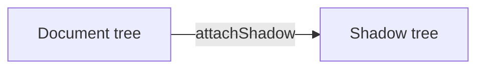

# Tutorial Source Format (`<slug>.source.md`)

Compact authoring syntax compiled by `scripts/compile.js` into a self-contained HTML page. Author ONLY content — all layout/CSS/JS comes from TEMPLATE.html.

## Frontmatter (YAML)

```yaml
---
title: Shadow DOM — Encapsulation for Web Components
subtitle: What the shadow root is, why styles don't leak, and how to pierce it when testing.
type: topic              # topic (ends with quiz) | code-showcase (no quiz)
format: standard         # brief | standard (default) | deep — see table below
category: webdev         # OneDrive folder name
slug: shadow-dom         # stable; keys localStorage progress — never change after publish
date: 2026-07-24
track: Web Components track   # optional topbar subtitle
videos:                  # 0-2 link cards (real YouTube URLs)
  - title: "Video title"
    channel: "Channel Name"
    duration: "12:24"
    url: https://www.youtube.com/watch?v=...
glossary:                # term -> definition (HTML-lite: `code` allowed)
  shadow root: "The hidden DOM subtree attached via `attachShadow()`..."
references:              # rendered as References card; url = 📄 external, file = 📁 local
  - title: Using shadow DOM
    url: https://developer.mozilla.org/en-US/docs/Web/API/Web_components/Using_shadow_DOM
  - title: mr241-test-review.html
    file: $MPX_AI_GENERATED/_TUTORIALS/yoursafe-components/mr241-test-review.html
---
```

## Format

| | `brief` | `standard` | `deep` |
| --- | --- | --- | --- |
| Prose budget per section | 60 words | 200 words | unlimited |
| Quiz | rejected | expected (`topic`) | expected (`topic`) |
| `:::reveal` | warned | ≤1 per section | ≤1 per section |
| Carries the content | annotated code + notes | prose + code | prose, walkthroughs, diagrams |

`brief` is the default choice for introducing something to a team: readers skim the code and its
notes, not paragraphs. Annotated code is preferred in every `brief` section, though a section that
genuinely has no code (a rationale or a "what's missing" list) may skip it.

The prose budget counts paragraphs, callout bodies, recap bullets and reveal bodies — **not**
annotated-code note bodies, which are where `brief` content is supposed to live. Overruns print a
compile warning and still build; treat the warning as a rewrite instruction, not noise.

The practical consequence in `brief`: **anything that needs explaining goes in an annotated code
block**, and a plain diff is for changes that speak for themselves. Reaching for a paragraph to
explain a diff is the signal you should have annotated it instead.

## Sections

`# <slug> | <Title>` starts a section. Slug is the stable progress key — reuse the exact slug when editing an existing tutorial.

```markdown
# why-shadow-dom | Why encapsulate at all?
```

**Titles must be ≤40 characters** — the contents rail is one column, and a longer title wraps to
four or five lines there. Compile warns past 40. Write the title as a label, not a sentence:
`Why a linter at all`, not `Why a linter when we already have tsc, svelte-check and Prettier`.

### Contents rail (reader-side)

Progress ring + contents are a 300px left rail, collapsible from the topbar button or `[`. Below
1400px it starts collapsed, because there the rail costs the annotated-code region more width than
it gives back; above, it starts open. An explicit toggle is remembered in `localStorage`
(`tutorial-sidebar`) and then wins at every width. Titles still need to fit the rail — it is one
button away at any size.

## Inline markup (in prose, callouts, recap, steps, quiz)

- `**bold**`, `*italic*`, `` `code` ``, `[text](https://url)` external link
- `[name](file:///C:/path)` → clickable local file link, 📁 prefix added automatically
- `((shadow root))` glossary term; `((Display text|shadow root))` when display differs from key

## Annotated code block

Fence with language + optional filename. Mark lines with `//@N` (or `#@N`) at end of line; define notes after the fence as `@N: Title | body`.

````markdown
```ts user-badge.ts
const shadow = this.attachShadow({ mode: "open" }); //@1
```
@1: Open vs. closed mode | `mode: "open"` exposes `element.shadowRoot` — essential for tests.
````

Desktop pins each note card beside its marked line and draws a bezier connector between them;
hovering either end highlights the line, the card and the wire. Mobile (≤1100px) renders
tap-to-expand inline cards instead. Same source. Collapsing the contents rail re-measures and
redraws every wire, so the code and cards get the reclaimed width.

Because cards are pinned to their lines, **keep note bodies short** — a tall card pushes every
following card down and its connector stretches into a long vertical sweep. 6-8 notes per block is
the practical ceiling; split a longer listing into two annotated blocks.

## Plain code block

Standard fence, no `//@N` markers: ` ```ts badge.test.ts `

## Walkthrough (click/hover-driven stepped code)

````markdown
:::walkthrough
```ts user-badge.evolution.ts
...full code, all phases...
```
== 1-9 | Start with a global `<style>`
Step body prose.
== 11-19 | Scope it with attachShadow
Step body prose.
:::
````

`== <lineStart>-<lineEnd> | <Step title>` — line numbers are 1-based into the fenced code.

## Callouts

```markdown
:::info Good to know
Body text.
:::

:::warn Watch out
Body text.
:::
```

## Recap (Key takeaways) — at section end, max one per section

Required in `standard` and `deep`. **Optional in `brief`**, where a three-line section followed by a
recap of the same three lines is the padding the format exists to remove — keep it only when the
takeaway is not already visible in the code.

```markdown
:::recap
- Bullet with **bold** and `code`.
- Second bullet.
:::
```

## Reveal ("Check yourself") — max ONE per chapter, only when it earns it

```markdown
:::reveal Why can't a page-level `.name` selector ever match inside the shadow tree?
Answer body (hidden until clicked).
:::
```

## Quiz — `topic` + `standard`/`deep` only, once, at the very end (after last section)

```markdown
:::quiz
Q: What does `mode: "open"` control?
- [ ] Whether outside CSS can style the shadow tree
- [x] Whether `element.shadowRoot` is accessible from outside JS
- [ ] Whether the element can use slots
> Correct-answer explanation shown after any pick.
:::
```

One `Q:` block per question; repeat Q/options/`>` inside the same `:::quiz` container.

## Playground (interactive CSS flexbox playground + challenges)

Only for layout/visual-CSS topics. Max ONE per tutorial. Renders mode tabs (Explore + numbered challenges), a live preview, control panel, and a live CSS readout with copy button.

````markdown
:::playground
items: 3                      # initial item count (min 2, max 6); add/remove available in Explore mode
item-labels: One | Two longer | Three
container:                    # controls applied to the flex container
  flex-direction: row | column | row-reverse | column-reverse
  justify-content: flex-start | center | flex-end | space-between | space-around
  align-items: stretch | flex-start | center | flex-end | baseline
  flex-wrap: nowrap | wrap
  gap: 0..32 step 8
item:                         # per-item controls (user clicks an item in the preview to select it)
  flex-grow: 0..3
  flex-shrink: 0..3
  order: -2..2
  align-self: auto | flex-start | center | flex-end
challenges:                   # 2-4 Froggy-style challenges; solved by matching ghost-target geometry (2px tolerance)
  - title: Dead center
    brief: Put all items in the exact center of the container.
    hint: You need one property per axis.
    items: 3                  # pins item count for the challenge (add/remove disabled)
    target:                   # flat form = container props only
      justify-content: center
      align-items: center
  - title: One rebel
    brief: Send the second item to the bottom.
    items: 3
    target:                   # nested form: container props + per-item props (1-indexed)
      container: { justify-content: center }
      item-2: { align-self: flex-end }
:::
````

Rules:

- Enum control: `a | b | c` — FIRST value is the default. Range control: `min..max` with optional `step n` (default 1), default = min. `gap` values render as `<value>px`.
- Challenge `target` may be flat (container props only) or nested `container:` / `item-N:`. Targets may ONLY use declared controls (compile fails otherwise).
- Ghost-matching is geometric — any control combination producing the same layout wins legitimately.
- Completed challenges persist in localStorage keyed by section slug + challenge index; they survive recompiles and stay replayable.

## Mermaid diagram

````markdown

````

Compiled to inline SVG in two theme variants (light `neutral`, dark `dark`) — the page shows the one matching the active theme. Requires `@mermaid-js/mermaid-cli` (installed via the skill's `npm install`); otherwise the build prints a "diagram skipped" warning and omits it.

## Compile

```bash
node scripts/compile.js path/to/<slug>.source.md [--out <dir>]
```

Writes `<slug>.html` beside the source (or to `--out`) and regenerates `$MPX_AI_GENERATED/_TUTORIALS/index.html`.
